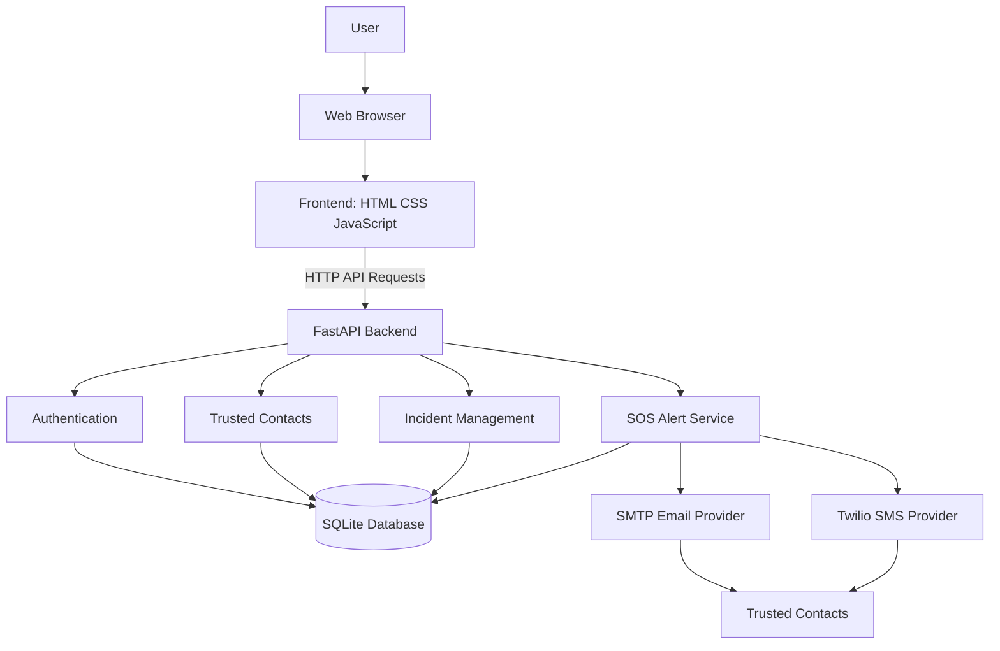
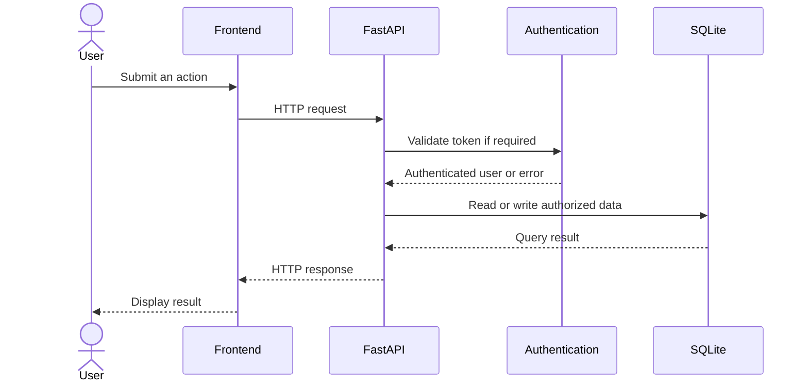
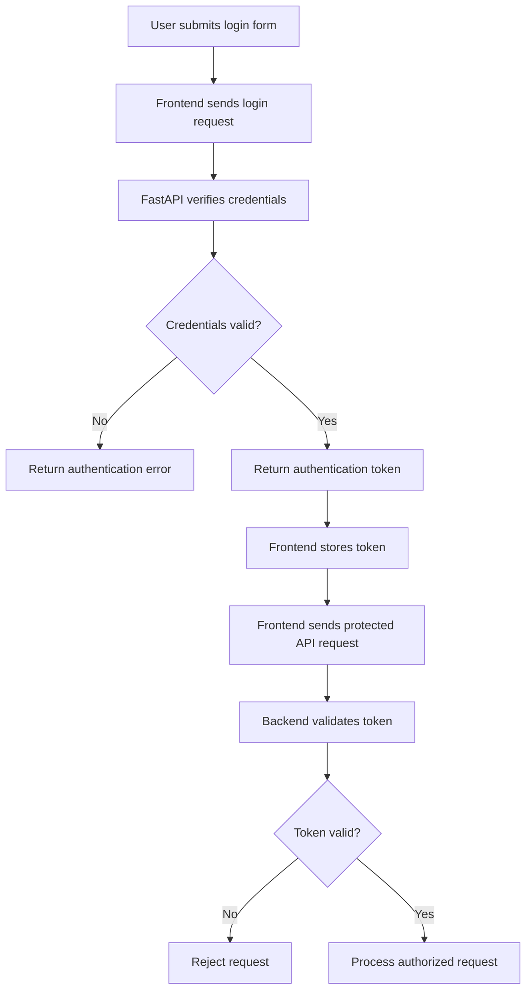
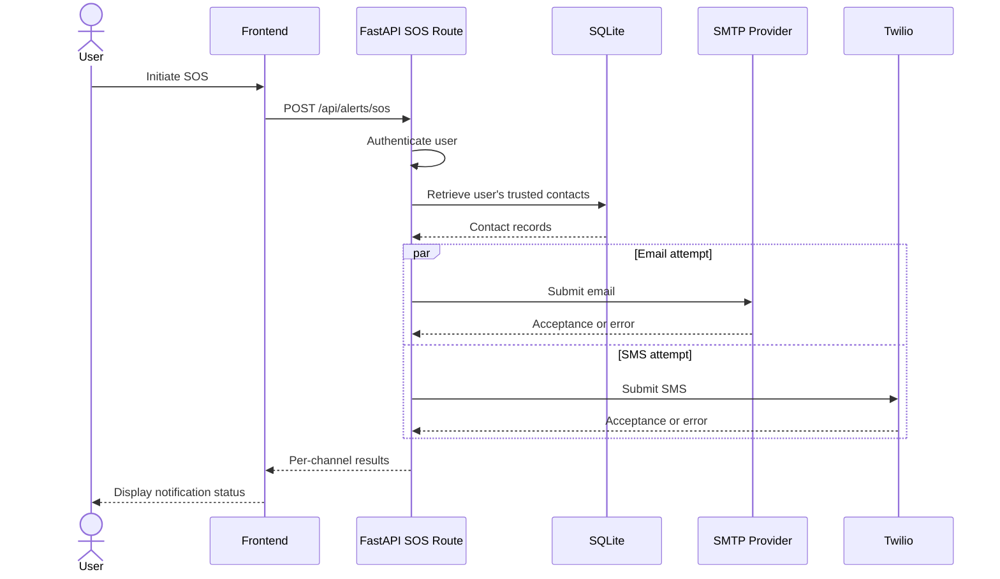
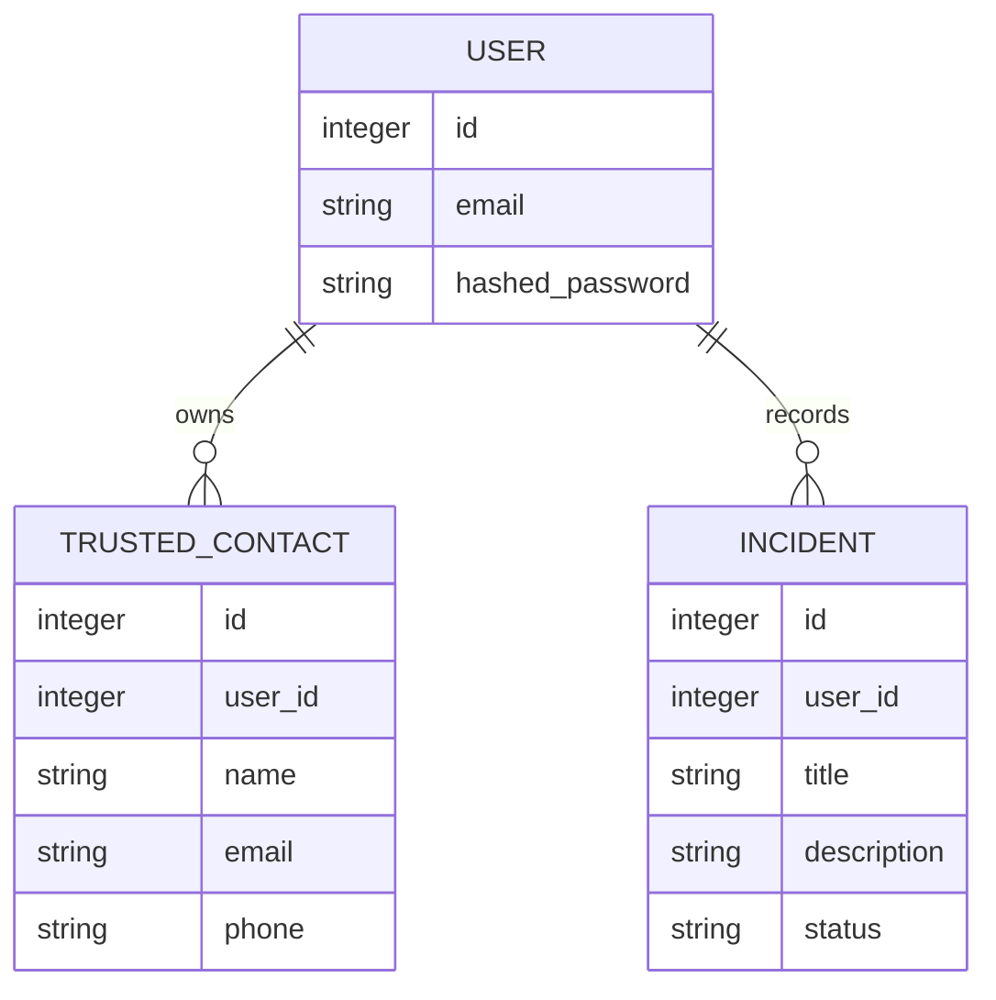
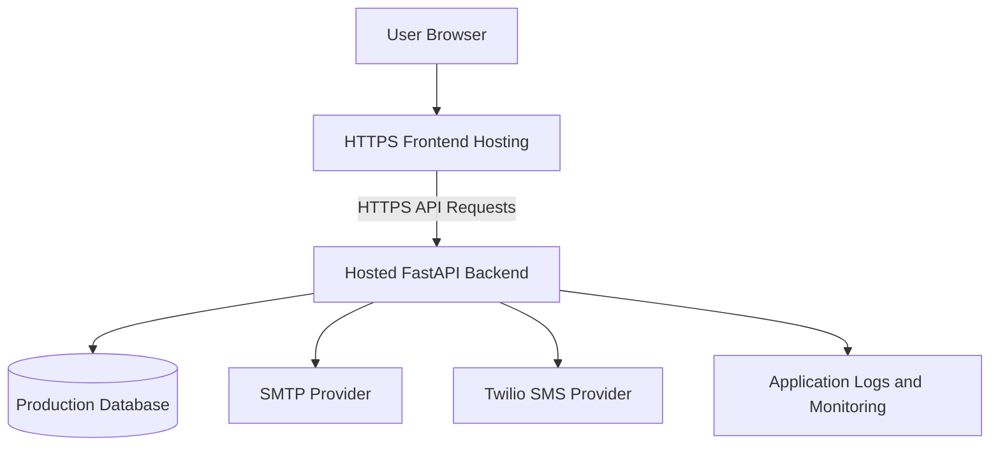

# SafeSphere AI — System Architecture

**Project:** SafeSphere AI  
**Document:** Architecture Overview  
**Version:** 1.0 (Draft)  
**Status:** In Development

---

## 1. Overview

SafeSphere AI is a web-based personal safety application designed to help users manage trusted contacts, record safety incidents, and initiate SOS notification attempts.

The system follows a client-server architecture:

- **Frontend:** HTML, CSS, and JavaScript.
- **Backend:** Python with FastAPI.
- **Database:** SQLite.
- **Email notifications:** SMTP integration.
- **SMS notifications:** Twilio integration.

The frontend communicates with the backend through HTTP API requests. The backend handles authentication, application logic, database operations, and notification requests.

> This document reflects the architecture discussed so far. Confirm all modules, routes, and database fields against the actual source code before treating it as final.

---

## 2. High-Level Architecture



### Architecture Explanation

1. The user interacts with SafeSphere AI through a web browser.
2. The frontend displays pages, forms, dashboards, and safety controls.
3. JavaScript sends API requests to the FastAPI backend.
4. The backend validates requests and authenticates protected operations.
5. Application data is stored in SQLite.
6. The SOS service retrieves the authenticated user's trusted contacts.
7. The backend attempts email and SMS notifications through configured providers.
8. The frontend displays the results returned by the backend.

---

## 3. Technology Stack

| Layer | Technology | Responsibility |
|---|---|---|
| Presentation | HTML | Page structure |
| Styling | CSS | Layout and visual design |
| Client logic | JavaScript | Events, forms, API calls |
| API server | FastAPI | HTTP endpoints |
| Programming language | Python | Backend application logic |
| Database | SQLite | Persistent application data |
| ORM | SQLAlchemy, if configured | Database access |
| Authentication | Bearer token | Protected API access |
| Email provider | SMTP | Email notification attempts |
| SMS provider | Twilio | SMS notification attempts |
| API documentation | FastAPI Swagger UI | API exploration and testing |

---

## 4. Main System Components

### 4.1 Frontend

The frontend is responsible for user interaction and presentation.

**Responsibilities:**

- Display registration and login forms.
- Display the dashboard.
- Collect trusted contact information.
- Display incident records.
- Initiate SOS requests.
- Send HTTP requests to the backend.
- Include the authentication token for protected requests.
- Display loading, success, and error messages.

**Known frontend configuration:**

```javascript
const API_BASE = "http://127.0.0.1:8000";
```

This address is for local development. A deployed frontend must use the appropriate backend URL.

### 4.2 FastAPI Backend

The backend is the central application layer.

**Responsibilities:**

- Receive HTTP requests.
- Validate request data.
- Authenticate users.
- Enforce access permissions.
- Execute application logic.
- Read and write database records.
- Initiate email and SMS notification attempts.
- Return structured responses.

### 4.3 Authentication Module

The authentication module manages account access.

**Responsibilities:**

- Process registration and login requests.
- Verify passwords against stored password hashes.
- Issue or validate authentication tokens, according to the implementation.
- Identify the authenticated user.
- Protect private endpoints.

The exact token format, expiration policy, and registration/login route names must be confirmed from the source code.

### 4.4 Trusted Contacts Module

This module manages contacts associated with a user.

**Responsibilities:**

- Create trusted contacts.
- Retrieve contacts belonging to the authenticated user.
- Update or delete contacts if those operations are implemented.
- Provide contact details to the SOS service when needed.
- Enforce user ownership.

### 4.5 Incident Management Module

This module manages safety incident records.

**Responsibilities:**

- Create incident records.
- Retrieve a user's incidents.
- Update incident information or status where supported.
- Delete records where supported.
- Enforce ownership and data validation.

### 4.6 SOS Alert Module

The SOS module coordinates notification attempts.

**Responsibilities:**

1. Receive an authenticated SOS request.
2. Identify the requesting user.
3. Retrieve that user's trusted contacts.
4. Build the alert message.
5. Attempt configured email notifications.
6. Attempt configured SMS notifications.
7. Return channel-specific results.

**Important:** An HTTP success response or provider acceptance does not necessarily mean the message was delivered or read.

### 4.7 Database Module

The database layer stores persistent application data.

The current local database technology is SQLite.

**Responsibilities:**

- Store user records.
- Store trusted contacts.
- Store incident records.
- Maintain relationships between users and their records.
- Support application queries and updates.

The actual schema and relationship definitions should be verified in the model files.

---

## 5. Backend Request Flow



### Request Processing Steps

1. The user performs an action in the browser.
2. JavaScript creates an API request.
3. The request is sent to FastAPI.
4. The backend validates input and authentication.
5. The backend checks whether the user is authorized.
6. The backend performs the required operation.
7. The backend returns a response.
8. The frontend updates the interface.

---

## 6. Authentication Architecture

The frontend uses a bearer token for authenticated API requests, according to the project details shared so far.



### Security Considerations

- Passwords should be stored as secure hashes.
- Protected endpoints should validate tokens.
- The backend should derive user identity from the validated token.
- Users must not access other users' contacts or incidents.
- Tokens should not be placed in URLs.
- Production deployment should use HTTPS.
- Token storage and expiration should be reviewed before public deployment.

The project has been described as using `sessionStorage` for the frontend token. This should be reviewed for the intended deployment and threat model.

---

## 7. SOS Notification Architecture



### Notification Result Interpretation

The backend should report email and SMS outcomes separately.

| Result | Meaning |
|---|---|
| Email accepted | SMTP accepted the message submission |
| Email failed | The email submission encountered an error |
| SMS accepted | Twilio accepted the SMS request |
| SMS failed | The SMS request encountered an error |
| Delivery confirmed | Provider delivery status confirms delivery, if available |

Do not label a notification as “delivered” unless delivery status is actually available and confirms it.

### Failure Handling

- Email failure should not automatically prevent an SMS attempt.
- SMS failure should not automatically prevent an email attempt.
- Missing contacts should produce a clear response.
- Invalid provider credentials should be logged safely.
- Provider secrets must not be returned to the frontend.
- The UI should explain when no notification could be sent.

---

## 8. Database Architecture

The application currently uses SQLite for local persistence.

### Conceptual Entity Relationship



**Note:** This is a conceptual diagram, not a verified database schema. Confirm actual field names, types, constraints, and relationships in the project's SQLAlchemy models.

### Data Ownership

Each trusted contact and incident should be associated with its owner.

The backend should ensure that:

- A user can retrieve only their own records.
- A user cannot modify another user's records.
- A user cannot delete another user's records.
- User identity is obtained from authentication, not trusted from arbitrary client input.

---

## 9. API Architecture

The frontend communicates with FastAPI through HTTP endpoints.

### Known Endpoint References

| Endpoint | Purpose |
|---|---|
| `/api/health` | Check API availability |
| `/api/auth/me` | Retrieve current authenticated user |
| `/api/contacts` | Trusted contact operations |
| `/api/incidents` | Incident operations |
| `/api/alerts/sos` | Initiate SOS notification attempts |

These endpoint paths are based on the development information shared so far. Confirm exact HTTP methods, request schemas, and response formats in the backend routers.

### API Request Pattern

```javascript
async function apiRequest(path, options = {}) {
    const token = sessionStorage.getItem("token");

    const headers = {
        ...(options.headers || {})
    };

    if (token) {
        headers.Authorization = `Bearer ${token}`;
    }

    return fetch(`${API_BASE}${path}`, {
        ...options,
        headers
    });
}
```

This is an illustrative request pattern. Keep the implementation consistent with the existing `apiRequest()` function in the project and ensure JSON requests include the appropriate content type.

---

## 10. Configuration and Secrets

The backend uses environment configuration for external service integrations.

### Configuration Categories

**Application:**
- Backend host and port.
- Database connection settings.
- CORS configuration.

**Email:**
- SMTP host.
- SMTP port.
- SMTP username.
- SMTP password or provider-approved credential.
- Sender email address.

**SMS:**
- Twilio Account SID.
- Twilio authentication token.
- Authorized Twilio sender number or messaging service.

### Secret Management Rules

- Keep secrets in the backend environment.
- Do not put SMTP or Twilio credentials in frontend JavaScript.
- Do not commit `.env` files to Git.
- Use hosting-provider secret storage for deployment.
- Rotate credentials if they are exposed.
- Avoid printing credentials in terminal logs or API responses.

---

## 11. Local Development Architecture

### Backend

The backend runs locally at:

```text
http://127.0.0.1:8000
```

Start it using PowerShell:

```powershell
cd D:\work\SafeSphere-AI\backend
.\.venv\Scripts\Activate.ps1
python -m uvicorn app.main:app --reload --host 127.0.0.1 --port 8000
```

### Frontend

The frontend can be served locally on port 5500:

```powershell
cd D:\work\SafeSphere-AI
python -m http.server 5500
```

Open the frontend at the appropriate served path, for example:

```text
http://127.0.0.1:5500/frontend/index.html
```

### API Documentation

FastAPI Swagger UI:

```text
http://127.0.0.1:8000/docs
```

Health endpoint:

```text
http://127.0.0.1:8000/api/health
```

These commands and paths reflect the previously shared local setup. Adjust them if the project's folder structure or entrypoint has changed.

---

## 12. Error Handling and Observability

The system should handle errors at both frontend and backend levels.

### Frontend

- Display validation errors near the relevant form.
- Show loading states for API requests.
- Handle non-success HTTP responses.
- Avoid displaying raw stack traces.
- Show separate email and SMS outcomes for SOS requests.

### Backend

- Validate incoming request data.
- Return suitable HTTP status codes.
- Log useful diagnostic information.
- Avoid logging passwords, tokens, or provider secrets.
- Handle database and external provider failures.
- Keep notification channels independent where possible.

### Operational Checks

A successful health check confirms that the API responds. It does not prove that all integrations are working.

Email, SMS, database access, authentication, and authorization require separate tests.

---

## 13. Security Architecture

### Required Controls

1. Password hashing.
2. Authentication for protected routes.
3. Per-user authorization checks.
4. Input validation.
5. Safe error responses.
6. Environment-based secrets.
7. HTTPS in production.
8. Explicit CORS configuration.
9. Rate limiting for sensitive operations such as SOS.
10. Protection against unauthorized access to contact and incident records.

### Privacy

The application may store personal contact details and safety-related records.

The system should:

- Collect only necessary information.
- Restrict access to authorized users.
- Explain data usage to users.
- Define retention and deletion behavior.
- Use location information only as clearly disclosed and intended.

---

## 14. Deployment Architecture

The local setup uses separate frontend and backend development servers.

A future hosted deployment may use this general structure:



### Production Preparation

Before public deployment:

- Replace localhost API URLs with the hosted backend URL.
- Configure HTTPS.
- Configure allowed frontend origins.
- Use production environment variables and secrets.
- Review database persistence and backup requirements.
- Add rate limiting and monitoring.
- Test authentication and data ownership.
- Verify email and SMS provider configuration.
- Document limitations of emergency notification functionality.

SQLite may be suitable for local development and some limited deployments, but production suitability depends on hosting persistence, concurrency, backup, and operational requirements.

---

## 15. Current Known Limitations

Based on the development logs shared so far:

- The backend has started successfully in local development.
- Several API routes have returned successful statuses in the reported logs.
- SOS requests have reached the backend.
- SMTP authentication has failed.
- Twilio returned HTTP 401 with error code `20003`.
- Email and SMS integrations therefore require configuration troubleshooting.

These observations do not constitute a complete security review or end-to-end test.

---

## 16. Architecture Decisions

| Decision | Current Approach | Reason / Context |
|---|---|---|
| Frontend | HTML, CSS, JavaScript | Lightweight web interface |
| Backend | FastAPI | Python-based API service |
| Database | SQLite | Local development persistence |
| Authentication | Bearer token | Protect API requests |
| Email | SMTP | External email notification |
| SMS | Twilio | External SMS notification |
| API documentation | Swagger UI | Interactive endpoint testing |

These decisions describe the current discussed implementation, not a final production architecture approval.

---

## 17. Future Architecture Improvements

Potential future improvements include:

- Automated backend tests.
- Frontend and backend deployment configuration.
- Production database evaluation.
- Stronger session and token lifecycle management.
- Rate limiting and abuse prevention.
- Notification delivery-status tracking.
- Centralized structured logging.
- Monitoring and alerting.
- Accessibility and multilingual support.
- Optional location sharing with explicit consent.
- Carefully scoped AI-assisted safety features.

Future AI features should be clearly separated from emergency response guarantees and should communicate uncertainty and limitations.

---

## 18. Conclusion

SafeSphere AI uses a client-server architecture in which a browser-based frontend communicates with a FastAPI backend. The backend manages authentication, trusted contacts, incidents, database operations, and SOS notification attempts.

SQLite provides local persistence, while SMTP and Twilio are external notification services.

The architecture should prioritize user privacy, secure access control, reliable error handling, and accurate notification status reporting. The application must not promise guaranteed message delivery or emergency response.

---

**Document Status:** Draft — verify all diagrams, API paths, model fields, and implemented features against the current source code before finalizing.