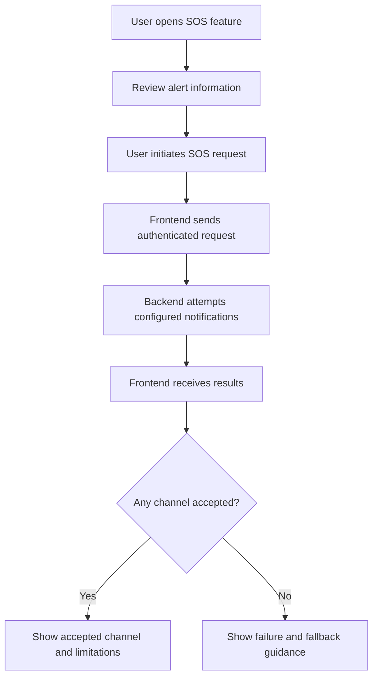

# SafeSphere AI — UI/UX Design Document

**Project:** SafeSphere AI  
**Document:** Design System and User Interface Guidelines  
**Version:** 1.0  
**Status:** Development Draft

---

## 1. Design Overview

SafeSphere AI is a personal safety web application designed to help users manage trusted contacts, record incidents, and initiate SOS notification attempts.

The design should be simple, clear, responsive, and accessible. Users should be able to understand the interface quickly, especially when accessing important safety-related functions.

The interface should communicate actions and results honestly without suggesting that emergency assistance or message delivery is guaranteed.

---

## 2. Design Goals

1. Create a clean and modern safety dashboard.
2. Make navigation easy to understand.
3. Make SOS functionality easy to locate.
4. Keep forms simple and readable.
5. Display incidents and trusted contacts clearly.
6. Provide visible feedback for successful and failed actions.
7. Support desktop, tablet, and mobile screens.
8. Follow accessibility and privacy-conscious design practices.

---

## 3. Design Principles

### 3.1 Clarity

Use simple labels, readable text, and predictable navigation.

### 3.2 Accessibility

Use sufficient color contrast, clear form labels, keyboard-accessible controls, and visible focus states.

### 3.3 Consistency

Use consistent buttons, cards, spacing, typography, and status indicators throughout the application.

### 3.4 Safety-Aware Interaction

Make emergency-related actions recognizable. Use confirmation or cancellation controls where appropriate, while avoiding unnecessary delays in urgent workflows.

### 3.5 Honest Feedback

Clearly distinguish between a request being submitted, accepted by a provider, confirmed delivered, or failed.

### 3.6 Privacy

Do not display unnecessary personal information. Show trusted contact details only in appropriate authenticated areas.

---

## 4. Visual Identity

### 4.1 Product Name

**SafeSphere AI**

### 4.2 Brand Direction

The visual identity should communicate:

- Safety.
- Trust.
- Clarity.
- Technology.
- Calmness.
- Reliability.

### 4.3 Suggested Visual Style

Use a modern dashboard design with:

- Clean cards.
- Rounded corners.
- Consistent spacing.
- Simple icons.
- Clear headings.
- Subtle shadows.
- Responsive layouts.
- Limited decorative animation.

The interface should remain readable and functional rather than relying on visual effects.

---

## 5. Color System

The following colors are suggested design tokens. They are not verified against the current CSS implementation.

| Token | Suggested Color | Usage |
|---|---|---|
| Primary | `#2563EB` | Main actions and active navigation |
| Primary Dark | `#1D4ED8` | Hover and active states |
| Background | `#F8FAFC` | Main light-mode background |
| Surface | `#FFFFFF` | Cards and forms |
| Text Primary | `#0F172A` | Main text |
| Text Secondary | `#64748B` | Supporting text |
| Border | `#E2E8F0` | Dividers and card borders |
| Success | `#16A34A` | Successful operations |
| Warning | `#D97706` | Warnings and pending states |
| Error | `#DC2626` | Errors and failed operations |
| Dark Background | `#0F172A` | Optional dark-mode background |
| Dark Surface | `#1E293B` | Optional dark-mode cards |

### Color Usage Rules

- Do not rely on color alone to communicate status.
- Pair status colors with text or icons.
- Maintain sufficient contrast.
- Use the error color carefully for important warnings and failures.
- Keep the SOS action visually distinct without making the entire interface alarming.

---

## 6. Typography

### 6.1 Font Family

Suggested font stack:

```css
font-family: Inter, "Segoe UI", Arial, sans-serif;
```

### 6.2 Type Scale

| Element | Suggested Size |
|---|---:|
| Main page heading | 28–32px |
| Section heading | 20–24px |
| Card heading | 16–18px |
| Body text | 14–16px |
| Supporting text | 12–14px |
| Button text | 14–16px |

### Typography Rules

- Use readable font sizes.
- Maintain clear heading hierarchy.
- Avoid long blocks of small text.
- Use bold text selectively.
- Keep line spacing comfortable.

---

## 7. Layout System

### 7.1 General Layout

The application should use a responsive dashboard layout.

Suggested desktop structure:

```text
+----------------------------------------------------------+
| SafeSphere AI                         Profile / Account  |
+-------------------+--------------------------------------+
|                   |                                      |
| Sidebar           | Main Content                         |
|                   |                                      |
| Dashboard         | Page Heading                         |
| Trusted Contacts  | Summary Cards                        |
| Incidents         | Main Feature Content                 |
| SOS               |                                      |
| Settings          |                                      |
|                   |                                      |
+-------------------+--------------------------------------+
```

### 7.2 Layout Rules

- Use a consistent page container.
- Keep content aligned to a clear grid.
- Use whitespace to separate sections.
- Avoid overcrowding the dashboard.
- Keep important actions visible.
- Make the sidebar collapsible or replace it with mobile navigation on small screens.

---

## 8. Spacing and Shape Tokens

Suggested spacing scale:

| Token | Value |
|---|---:|
| XS | 4px |
| SM | 8px |
| MD | 16px |
| LG | 24px |
| XL | 32px |
| XXL | 48px |

Suggested corner radii:

| Element | Radius |
|---|---:|
| Small controls | 6px |
| Buttons | 8px |
| Cards | 12px |
| Large panels | 16px |

Use spacing consistently rather than assigning unrelated values to every element.

---

## 9. Main Application Screens

### 9.1 Login Page

**Purpose:** Allow existing users to authenticate.

**Elements:**

- SafeSphere AI logo or wordmark.
- Welcome heading.
- Email input.
- Password input.
- Show/hide password control, if implemented.
- Login button.
- Link to registration.
- Form validation and error messages.

**Design requirements:**

- Keep the form focused and uncluttered.
- Clearly label each input.
- Show authentication errors without exposing sensitive details.
- Provide visible loading feedback during login.

### 9.2 Registration Page

**Purpose:** Allow new users to create an account.

**Elements:**

- Welcome heading.
- Required registration fields.
- Password field.
- Confirm-password field, if part of the implementation.
- Register button.
- Link to login.
- Validation messages.

**Design requirements:**

- Explain required fields.
- Validate user input.
- Avoid displaying or storing plaintext passwords in the interface beyond the user's input field.
- Provide a clear success or failure state.

### 9.3 Dashboard

**Purpose:** Provide a central overview of safety-related features.

**Suggested elements:**

- Welcome message.
- Navigation menu.
- Trusted contacts summary.
- Incident summary.
- Recent incident list, if available.
- SOS action.
- Account or settings access.

**Design requirements:**

- Keep the main actions easy to find.
- Avoid displaying invented statistics.
- Show empty states when the user has no records.
- Use real API data for counts and summaries.

### 9.4 Trusted Contacts Page

**Purpose:** Allow users to manage trusted contact information.

**Elements:**

- Page heading.
- Add contact button.
- Contact list or cards.
- Contact name.
- Email and phone, when available and appropriate.
- Edit and delete actions, if implemented.
- Empty state.
- Form validation and feedback.

**Design requirements:**

- Keep contact details readable.
- Confirm destructive actions when appropriate.
- Do not expose contacts to unauthenticated users.
- Make missing contact information clear.

### 9.5 Incidents Page

**Purpose:** Allow users to create and review incident records.

**Elements:**

- Page heading.
- Create incident button or form.
- Incident list.
- Incident title.
- Description or summary.
- Status indicator.
- Date or timestamp, if available.
- View or edit actions, if implemented.

**Design requirements:**

- Use readable incident cards or a clear table.
- Distinguish statuses using text and visual indicators.
- Provide an empty state.
- Avoid displaying another user's incident information.

### 9.6 SOS Page or Panel

**Purpose:** Allow the user to initiate a notification attempt to trusted contacts.

**Elements:**

- Clear SOS heading.
- Short explanation of what the feature does.
- Alert message input, if supported.
- Location input or sharing control, if supported.
- SOS action button.
- Confirmation or cancellation step, where appropriate.
- Email result.
- SMS result.
- Fallback emergency guidance.

**Design requirements:**

- Clearly communicate that the feature attempts to notify configured contacts.
- Do not imply that police or emergency services are automatically contacted unless that integration exists and is verified.
- Show separate email and SMS outcomes.
- Distinguish provider acceptance from confirmed delivery.
- Display an error if no notification channel succeeds.
- Provide a direct emergency-services fallback instruction.

### 9.7 Settings Page

**Purpose:** Provide access to account or application settings, if implemented.

Possible elements:

- Account information.
- Password or session controls.
- Theme preference.
- Notification configuration.
- Privacy information.

Do not display settings that are not actually implemented.

---

## 10. Navigation Design

Suggested primary navigation:

1. Dashboard
2. Trusted Contacts
3. Incidents
4. SOS
5. Settings

### Navigation Rules

- Clearly highlight the current page.
- Use readable labels alongside icons where possible.
- Keep navigation consistent across pages.
- Provide a mobile-friendly navigation pattern.
- Do not show links to unfinished features as if they are operational.

---

## 11. Component Design

### 11.1 Buttons

Suggested button types:

| Type | Purpose |
|---|---|
| Primary | Main page action |
| Secondary | Supporting action |
| Danger | Destructive action |
| Text | Low-emphasis action |
| Disabled | Unavailable action |

Button requirements:

- Use clear action labels.
- Show hover and focus states.
- Provide disabled states when an action cannot be performed.
- Prevent repeated submissions while a request is processing where practical.
- Do not use ambiguous labels such as “Click Here” for important actions.

### 11.2 Cards

Cards may be used for:

- Dashboard summaries.
- Trusted contacts.
- Incidents.
- Notification results.

Card requirements:

- Consistent padding.
- Clear heading.
- Readable supporting text.
- Appropriate borders or shadows.
- Responsive width.

### 11.3 Forms

Form requirements:

- Visible labels.
- Helpful placeholders where appropriate.
- Required-field indicators.
- Clear validation messages.
- Keyboard accessibility.
- Submit feedback.
- Appropriate input types.

### 11.4 Status Indicators

Suggested status labels:

- Pending.
- In progress.
- Resolved.
- Failed.
- Accepted by provider.
- Delivery confirmed, only when verified.

Use only statuses that match the backend's actual data and behavior.

---

## 12. SOS Interaction Design

The SOS workflow should be simple and communicate the result accurately.

### Suggested Interaction Flow



### Interaction Requirements

- Use clear action text.
- Prevent accidental repeated requests where practical.
- Show a loading state while the request is processing.
- Do not block the user indefinitely if the backend fails.
- Present email and SMS outcomes separately.
- Keep fallback guidance visible when attempts fail.
- Do not claim confirmed delivery without delivery evidence.

---

## 13. Feedback and Status Messages

The interface should provide feedback for important actions.

| Situation | Suggested Message |
|---|---|
| Login successful | “You are signed in.” |
| Invalid login | “The email or password is incorrect.” |
| Contact saved | “Trusted contact saved.” |
| Incident saved | “Incident saved.” |
| Request processing | “Processing your request…” |
| Email accepted | “Email request accepted by the provider.” |
| SMS accepted | “SMS request accepted by the provider.” |
| Notification failed | “The notification could not be sent.” |
| No contacts | “Add a trusted contact before using this notification feature.” |

These are suggested messages. Adapt them to the actual API response and provider status.

---

## 14. Responsive Design

The application should support:

- Desktop screens.
- Laptop screens.
- Tablets.
- Mobile phones.

### Desktop

- Sidebar navigation.
- Main content area.
- Multi-column summary cards where useful.

### Tablet

- Reduced sidebar width or collapsible navigation.
- Flexible card grids.
- Comfortable touch targets.

### Mobile

- Single-column content.
- Compact navigation.
- Full-width forms and primary buttons where appropriate.
- Avoid horizontal scrolling.
- Keep critical actions visible and usable.

### Responsive Breakpoints

Suggested starting points:

```css
/* Tablet */
@media (max-width: 900px) {
    /* Adapt navigation and content layout */
}

/* Mobile */
@media (max-width: 600px) {
    /* Use compact navigation and single-column layouts */
}
```

Adjust these breakpoints after testing the actual interface.

---

## 15. Accessibility Requirements

1. Use semantic HTML.
2. Provide labels for all form controls.
3. Ensure keyboard navigation is usable.
4. Provide visible focus indicators.
5. Maintain readable contrast.
6. Use descriptive button labels.
7. Do not rely only on color to communicate status.
8. Provide text alternatives for meaningful images and icons.
9. Avoid unnecessary flashing or distracting animation.
10. Ensure error messages are understandable.

---

## 16. Dark Mode

Dark mode may be included if supported by the implementation.

### Suggested Guidelines

- Use a dark background with lighter text.
- Use distinct surfaces for cards and forms.
- Maintain readable contrast.
- Preserve status colors in a readable form.
- Ensure form fields and disabled controls remain visible.
- Keep the theme consistent across all pages.

Do not display a theme toggle unless its behavior is implemented.

---

## 17. Motion and Animation

Animations should be subtle and purposeful.

Appropriate examples:

- Small button hover transitions.
- Gentle card transitions.
- Loading indicators.
- Short navigation transitions.

Avoid:

- Excessive motion.
- Flashing effects.
- Long delays before important actions.
- Animations that obscure status messages.
- Motion that makes the SOS workflow harder to use.

Respect reduced-motion preferences where practical.

---

## 18. Error and Empty States

### Error States

Show a clear message when:

- The backend is unavailable.
- Login fails.
- A form contains invalid data.
- A contact cannot be saved.
- An incident cannot be loaded.
- Email or SMS authentication fails.
- An SOS request cannot be completed.

Avoid displaying raw exception messages or secret configuration details.

### Empty States

Examples:

**No trusted contacts**

“Your trusted contact list is empty. Add a contact to configure notifications.”

**No incidents**

“No incidents have been recorded yet.”

**No recent activity**

“Your recent activity will appear here when available.”

Do not invent records or activity to fill empty space.

---

## 19. Frontend Design Tokens

Suggested CSS variables:

```css
:root {
    --color-primary: #2563EB;
    --color-primary-dark: #1D4ED8;

    --color-background: #F8FAFC;
    --color-surface: #FFFFFF;

    --color-text-primary: #0F172A;
    --color-text-secondary: #64748B;

    --color-border: #E2E8F0;

    --color-success: #16A34A;
    --color-warning: #D97706;
    --color-error: #DC2626;

    --radius-small: 6px;
    --radius-medium: 8px;
    --radius-large: 12px;

    --spacing-xs: 4px;
    --spacing-sm: 8px;
    --spacing-md: 16px;
    --spacing-lg: 24px;
    --spacing-xl: 32px;

    --shadow-card: 0 4px 16px rgba(15, 23, 42, 0.06);
}
```

These tokens are a suggested starting point. Adjust them to match the actual stylesheet.

---

## 20. Design-to-Development Rules

1. Keep the interface consistent across pages.
2. Reuse shared CSS classes and components where practical.
3. Use real backend data for dashboard summaries.
4. Show loading states during API requests.
5. Handle empty and error states.
6. Do not show unfinished features as working.
7. Keep private user data within authenticated views.
8. Match displayed notification statuses to actual backend results.
9. Test responsive layouts after significant changes.
10. Update this document when the design system changes.

---

## 21. Design Acceptance Checklist

### Visual Design

- [ ] Consistent colors and typography.
- [ ] Clear page hierarchy.
- [ ] Consistent spacing and card styles.
- [ ] Readable buttons and form fields.
- [ ] Clear navigation.

### Usability

- [ ] Login and registration are understandable.
- [ ] Dashboard actions are easy to locate.
- [ ] Trusted contacts are easy to manage.
- [ ] Incidents are easy to review.
- [ ] SOS status is understandable.
- [ ] Error and empty states are present.

### Accessibility

- [ ] Form labels are present.
- [ ] Keyboard navigation works.
- [ ] Focus states are visible.
- [ ] Status does not rely on color alone.
- [ ] Text is readable on desktop and mobile.

### Safety and Privacy

- [ ] SOS messaging is accurate.
- [ ] No guaranteed delivery claims.
- [ ] No unsupported emergency-service integration claims.
- [ ] Private contact and incident data is protected.
- [ ] Failure states include useful next steps.

---

## 22. Conclusion

The SafeSphere AI design should provide a calm, clear, and accessible experience for managing trusted contacts, recording incidents, and initiating SOS notification attempts.

The interface should prioritize usability, privacy, responsive behavior, and accurate status reporting.

All visual elements and interactions must reflect features that are actually implemented and tested.

---

**Document Status:** Draft — review against the current frontend files and update the design tokens, screens, and interactions as the implementation evolves.