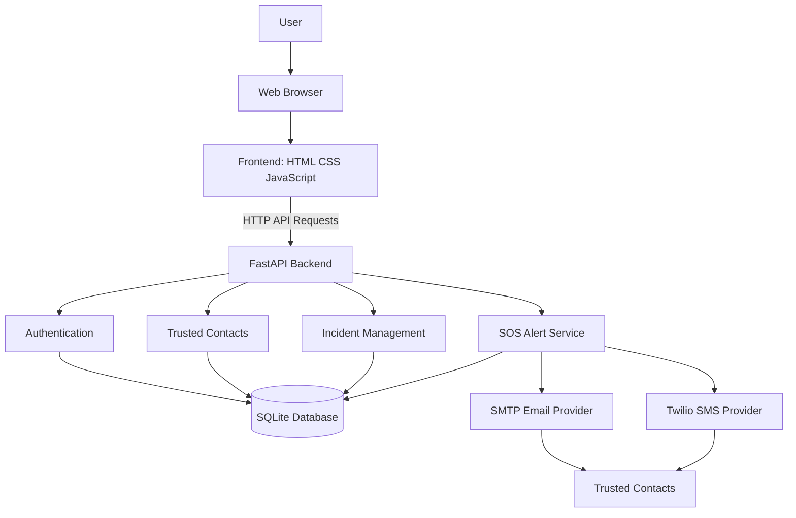
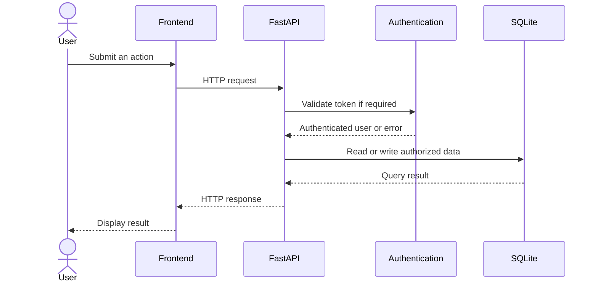
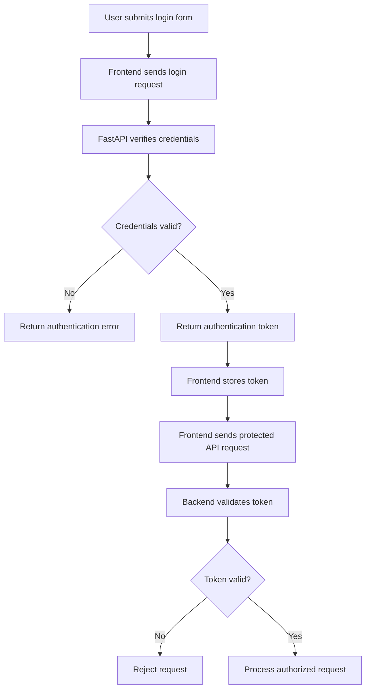
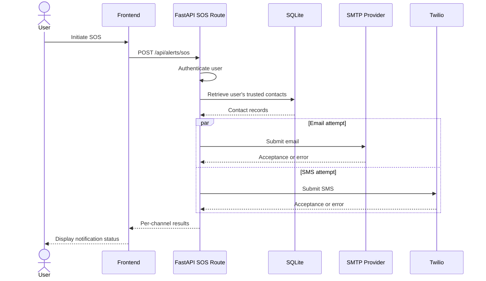
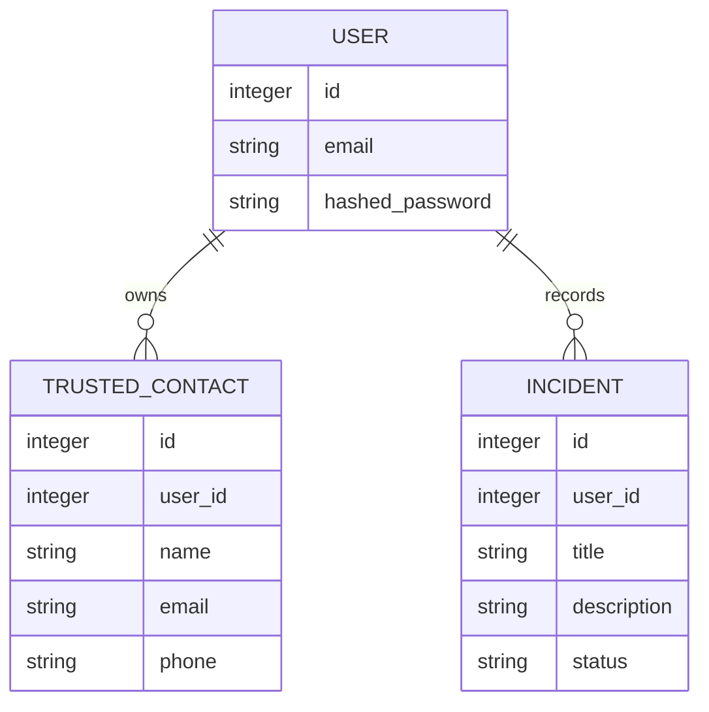
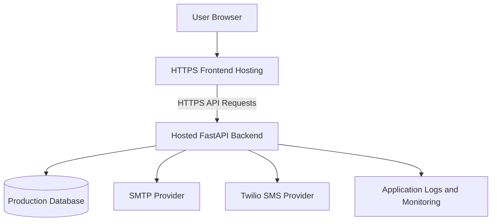
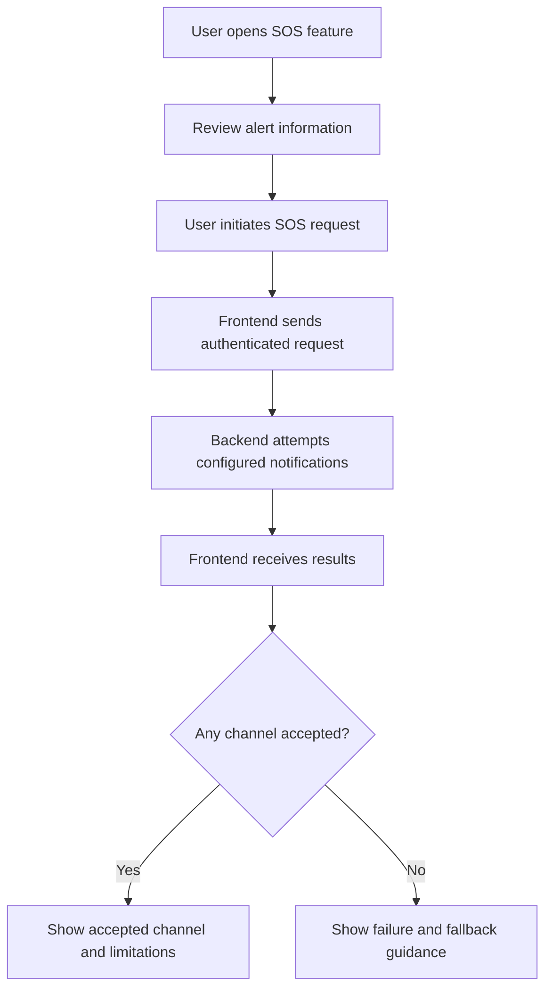

Directory structure:
└── jhaabhay7667-cyber-safesphere-ai/
    ├── backend/
    │   ├── requirements.txt
    │   └── app/
    │       ├── __init__.py
    │       ├── config.py
    │       ├── database.py
    │       ├── main.py
    │       ├── models.py
    │       ├── schemas.py
    │       ├── security.py
    │       └── routes/
    │           ├── __init__.py
    │           ├── alerts.py
    │           ├── auth.py
    │           ├── contacts.py
    │           └── incidents.py
    ├── docs/
    │   ├── ARCHITECTURE.md
    │   ├── DESIGN.md
    │   ├── MEMORY.md
    │   ├── PRD.md
    │   ├── RULES.md
    │   └── TASKS.md
    └── frontend/
        ├── app.js
        ├── index.html
        └── style.css


Files Content:

================================================
FILE: backend/requirements.txt
================================================

fastapi
uvicorn[standard]
sqlalchemy
pydantic[email]
pydantic-settings
pwdlib[argon2]
PyJWT
python-multipart
httpx
pytest


================================================
FILE: backend/app/__init__.py
================================================
[Empty file]


================================================
FILE: backend/app/config.py
================================================
from pydantic_settings import BaseSettings, SettingsConfigDict


class Settings(BaseSettings):
    app_name: str = "SafeSphere AI"

    database_url: str = "sqlite:///./safesphere.db"

    jwt_secret: str
    jwt_expire_minutes: int = 30

    frontend_origins: str = "http://127.0.0.1:5500"

    # Email settings
    smtp_host: str = ""
    smtp_port: int = 587
    smtp_username: str = ""
    smtp_password: str = ""
    smtp_from: str = ""

    # Twilio SMS settings
    twilio_account_sid: str = ""
    twilio_auth_token: str = ""
    twilio_phone_number: str = ""

    model_config = SettingsConfigDict(
        env_file=".env",
        extra="ignore",
    )


settings = Settings()


================================================
FILE: backend/app/database.py
================================================
from sqlalchemy import create_engine
from sqlalchemy.orm import declarative_base, sessionmaker

from .config import settings

connect_args = {}

if settings.database_url.startswith("sqlite"):
    connect_args = {"check_same_thread": False}

engine = create_engine(
    settings.database_url,
    connect_args=connect_args,
)

SessionLocal = sessionmaker(
    bind=engine,
    autoflush=False,
    autocommit=False,
)

Base = declarative_base()


def get_db():
    db = SessionLocal()

    try:
        yield db
    finally:
        db.close()


================================================
FILE: backend/app/main.py
================================================

from fastapi import FastAPI
from fastapi.middleware.cors import CORSMiddleware

from .config import settings
from .database import Base, engine
from . import models
from .routes import auth, incidents, contacts, alerts


Base.metadata.create_all(bind=engine)

app = FastAPI(
    title="SafeSphere AI",
    description="AI-powered safety and incident reporting platform",
    version="1.0.0",
)

app.add_middleware(
    CORSMiddleware,
    allow_origins=[
        origin.strip()
        for origin in settings.frontend_origins.split(",")
        if origin.strip()
    ],
    allow_credentials=True,
    allow_methods=["*"],
    allow_headers=["*"],
)

app.include_router(auth.router)
app.include_router(incidents.router)
app.include_router(contacts.router)

# SOS email + SMS router
app.include_router(alerts.router)


@app.get("/")
def root():
    return {
        "message": "Welcome to SafeSphere AI",
        "docs": "/docs",
    }


@app.get("/api/health")
def health_check():
    return {"status": "ok"}


================================================
FILE: backend/app/models.py
================================================
from datetime import datetime, timezone

from sqlalchemy import (
    Boolean,
    DateTime,
    Float,
    ForeignKey,
    Integer,
    String,
    Text,
)
from sqlalchemy.orm import Mapped, mapped_column, relationship

from app.database import Base


def utc_now():
    return datetime.now(timezone.utc)


class User(Base):
    __tablename__ = "users"

    id: Mapped[int] = mapped_column(Integer, primary_key=True, index=True)
    name: Mapped[str] = mapped_column(String(100), nullable=False)
    email: Mapped[str] = mapped_column(
        String(255), unique=True, index=True, nullable=False
    )
    hashed_password: Mapped[str] = mapped_column(String(255), nullable=False)
    is_active: Mapped[bool] = mapped_column(Boolean, default=True)
    created_at: Mapped[datetime] = mapped_column(
        DateTime(timezone=True), default=utc_now
    )

    incidents = relationship(
        "Incident", back_populates="owner", cascade="all, delete-orphan"
    )
    trusted_contacts = relationship(
        "TrustedContact", back_populates="owner", cascade="all, delete-orphan"
    )


class Incident(Base):
    __tablename__ = "incidents"

    id: Mapped[int] = mapped_column(Integer, primary_key=True, index=True)
    user_id: Mapped[int] = mapped_column(
        ForeignKey("users.id"), index=True, nullable=False
    )
    title: Mapped[str] = mapped_column(String(150), nullable=False)
    description: Mapped[str] = mapped_column(Text, nullable=False)
    category: Mapped[str] = mapped_column(String(50), default="Other")
    severity: Mapped[str] = mapped_column(String(20), default="Medium")
    location_text: Mapped[str | None] = mapped_column(String(255), nullable=True)
    latitude: Mapped[float | None] = mapped_column(Float, nullable=True)
    longitude: Mapped[float | None] = mapped_column(Float, nullable=True)
    status: Mapped[str] = mapped_column(String(30), default="Reported")
    created_at: Mapped[datetime] = mapped_column(
        DateTime(timezone=True), default=utc_now
    )

    owner = relationship("User", back_populates="incidents")


class TrustedContact(Base):
    __tablename__ = "trusted_contacts"

    id: Mapped[int] = mapped_column(Integer, primary_key=True, index=True)
    user_id: Mapped[int] = mapped_column(
        ForeignKey("users.id"), index=True, nullable=False
    )
    name: Mapped[str] = mapped_column(String(100), nullable=False)
    phone: Mapped[str] = mapped_column(String(30), nullable=False)
    email: Mapped[str | None] = mapped_column(String(255), nullable=True)
    relationship_label: Mapped[str | None] = mapped_column(
        String(50), nullable=True
    )
    created_at: Mapped[datetime] = mapped_column(
        DateTime(timezone=True), default=utc_now
    )

    owner = relationship("User", back_populates="trusted_contacts")


class IncidentAnalysis(Base):
    __tablename__ = "incident_analyses"

    id: Mapped[int] = mapped_column(Integer, primary_key=True, index=True)
    incident_id: Mapped[int] = mapped_column(
        ForeignKey("incidents.id"), index=True, nullable=False
    )
    summary: Mapped[str] = mapped_column(Text, nullable=False)
    recommended_actions: Mapped[str] = mapped_column(Text, nullable=False)
    created_at: Mapped[datetime] = mapped_column(
        DateTime(timezone=True), default=utc_now
    )


================================================
FILE: backend/app/schemas.py
================================================
from datetime import datetime
from pydantic import BaseModel, ConfigDict, EmailStr, Field


class RegisterRequest(BaseModel):
    name: str = Field(min_length=2, max_length=100)
    email: EmailStr
    password: str = Field(min_length=8, max_length=128)


class LoginRequest(BaseModel):
    email: EmailStr
    password: str


class UserResponse(BaseModel):
    id: int
    name: str
    email: EmailStr

    model_config = ConfigDict(from_attributes=True)


class AuthResponse(BaseModel):
    access_token: str
    token_type: str = "bearer"
    user: UserResponse


class IncidentCreate(BaseModel):
    title: str = Field(min_length=3, max_length=150)
    description: str = Field(min_length=5, max_length=5000)
    category: str = Field(default="Other", max_length=50)
    severity: str = "Medium"
    location_text: str | None = Field(default=None, max_length=255)
    latitude: float | None = Field(default=None, ge=-90, le=90)
    longitude: float | None = Field(default=None, ge=-180, le=180)


class IncidentStatusUpdate(BaseModel):
    status: str = Field(min_length=2, max_length=30)


class IncidentResponse(BaseModel):
    id: int
    title: str
    description: str
    category: str
    severity: str
    location_text: str | None
    latitude: float | None
    longitude: float | None
    status: str
    created_at: datetime

    model_config = ConfigDict(from_attributes=True)


class ContactCreate(BaseModel):
    name: str = Field(min_length=2, max_length=100)
    phone: str = Field(min_length=5, max_length=30)
    email: EmailStr | None = None
    relationship_label: str | None = Field(default=None, max_length=50)


class ContactResponse(BaseModel):
    id: int
    name: str
    phone: str
    email: str | None
    relationship_label: str | None
    created_at: datetime

    model_config = ConfigDict(from_attributes=True)


================================================
FILE: backend/app/security.py
================================================
from datetime import datetime, timedelta, timezone

import jwt
from pwdlib import PasswordHash

from .config import settings

password_hash = PasswordHash.recommended()

JWT_ALGORITHM = "HS256"


def hash_password(password: str) -> str:
    return password_hash.hash(password)


def verify_password(password: str, stored_hash: str) -> bool:
    return password_hash.verify(password, stored_hash)


def create_access_token(user_id: int) -> str:
    expires_at = datetime.now(timezone.utc) + timedelta(
        minutes=settings.jwt_expire_minutes
    )

    payload = {
        "sub": str(user_id),
        "exp": expires_at,
    }

    return jwt.encode(
        payload,
        settings.jwt_secret,
        algorithm=JWT_ALGORITHM,
    )


def decode_access_token(token: str) -> dict:
    return jwt.decode(
        token,
        settings.jwt_secret,
        algorithms=[JWT_ALGORITHM],
    )


================================================
FILE: backend/app/routes/__init__.py
================================================
[Empty file]


================================================
FILE: backend/app/routes/alerts.py
================================================

import logging
import smtplib
from email.message import EmailMessage
from typing import Optional

from fastapi import APIRouter, Depends, HTTPException
from pydantic import BaseModel, Field
from sqlalchemy.orm import Session
from twilio.rest import Client
from twilio.base.exceptions import TwilioRestException

from app.config import settings
from app.database import get_db
from app.models import TrustedContact
from app.routes.auth import get_current_user


# ============================================================
# LOGGER
# ============================================================

logger = logging.getLogger(__name__)


# ============================================================
# ROUTER
# ============================================================

router = APIRouter(
    prefix="/api/alerts",
    tags=["SOS Alerts"],
)


# ============================================================
# SOS REQUEST MODEL
# ============================================================

class SOSRequest(BaseModel):
    title: str = Field(
        default="Emergency SOS Alert",
        min_length=1,
        max_length=150,
    )

    message: str = Field(
        default="I need assistance. Please contact me.",
        min_length=1,
        max_length=2000,
    )

    location_text: Optional[str] = Field(
        default=None,
        max_length=500,
    )

    latitude: Optional[float] = None
    longitude: Optional[float] = None


# ============================================================
# EMAIL SENDING FUNCTION
# ============================================================

def send_email(
    recipient: str,
    subject: str,
    body: str,
) -> tuple[bool, str]:

    required_settings = [
        settings.smtp_host,
        settings.smtp_port,
        settings.smtp_username,
        settings.smtp_password,
        settings.smtp_from,
    ]

    if not all(required_settings):
        return False, "SMTP email settings are incomplete."

    try:
        email = EmailMessage()
        email["Subject"] = subject
        email["From"] = settings.smtp_from
        email["To"] = recipient
        email.set_content(body)

        with smtplib.SMTP(
            settings.smtp_host,
            settings.smtp_port,
            timeout=20,
        ) as server:

            server.ehlo()
            server.starttls()
            server.ehlo()

            server.login(
                settings.smtp_username,
                settings.smtp_password,
            )

            server.send_message(email)

        return True, "Email accepted by the SMTP server."

    except smtplib.SMTPAuthenticationError:
        logger.warning("SMTP authentication failed.")
        return False, (
            "Gmail authentication failed. "
            "Check the SMTP username and App Password."
        )

    except smtplib.SMTPRecipientsRefused:
        logger.warning("SMTP recipient was refused.")
        return False, "The email recipient was refused."

    except smtplib.SMTPException as exc:
        logger.warning(
            "SMTP sending failed: %s",
            type(exc).__name__,
        )
        return False, (
            f"SMTP sending failed: {type(exc).__name__}."
        )

    except (OSError, TimeoutError) as exc:
        logger.warning(
            "SMTP connection failed: %s",
            type(exc).__name__,
        )
        return False, (
            "Could not connect to the SMTP server."
        )

    except Exception as exc:
        logger.exception(
            "Unexpected email error: %s",
            type(exc).__name__,
        )
        return False, (
            "Unexpected email error. "
            "Check the backend terminal."
        )


# ============================================================
# SMS SENDING FUNCTION
# ============================================================

def send_sms(
    recipient: str,
    body: str,
) -> tuple[bool, str]:

    required_settings = [
        settings.twilio_account_sid,
        settings.twilio_auth_token,
        settings.twilio_phone_number,
    ]

    if not all(required_settings):
        return False, (
            "Twilio SMS settings are incomplete."
        )

    try:
        client = Client(
            settings.twilio_account_sid,
            settings.twilio_auth_token,
        )

        message = client.messages.create(
            body=body,
            from_=settings.twilio_phone_number,
            to=recipient,
        )

        logger.info(
            "Twilio accepted SMS request. "
            "SID=%s Status=%s",
            message.sid,
            message.status,
        )

        return True, (
            "Twilio accepted the SMS request. "
            f"Status: {message.status}. "
            f"Message SID: {message.sid}"
        )

    except TwilioRestException as exc:
        # Do not log or return account credentials.
        logger.warning(
            "Twilio rejected SMS. Code=%s HTTP=%s",
            exc.code,
            exc.status,
        )

        return False, (
            f"Twilio error code {exc.code}. "
            "Check your Twilio configuration and logs."
        )

    except Exception as exc:
        logger.exception(
            "Unexpected SMS error: %s",
            type(exc).__name__,
        )

        return False, (
            "Unexpected SMS error. "
            "Check the backend terminal."
        )


# ============================================================
# BUILD SOS MESSAGE
# ============================================================

def build_alert_message(
    current_user,
    request: SOSRequest,
) -> str:

    user_name = getattr(
        current_user,
        "name",
        None,
    ) or "A SafeSphere AI user"

    lines = [
        "SAFESPHERE AI - SOS ALERT",
        "",
        f"Alert from: {user_name}",
        f"Message: {request.message}",
    ]

    if request.location_text:
        lines.extend([
            "",
            f"Location: {request.location_text}",
        ])

    if (
        request.latitude is not None
        and request.longitude is not None
    ):
        lines.extend([
            (
                "Coordinates: "
                f"{request.latitude}, "
                f"{request.longitude}"
            ),
            (
                "Map: https://www.google.com/maps?q="
                f"{request.latitude},{request.longitude}"
            ),
        ])

    lines.extend([
        "",
        "Please contact the sender directly.",
        "",
        "This alert was generated by SafeSphere AI.",
    ])

    return "\n".join(lines)


# ============================================================
# SEND SOS ALERT
# ============================================================

@router.post("/sos")
def send_sos_alert(
    request: SOSRequest,
    db: Session = Depends(get_db),
    current_user=Depends(get_current_user),
):

    # --------------------------------------------------------
    # 1. Get contacts belonging to the logged-in user
    # --------------------------------------------------------

    contacts = (
        db.query(TrustedContact)
        .filter(
            TrustedContact.user_id == current_user.id
        )
        .all()
    )

    if not contacts:
        return {
            "success": False,
            "message": (
                "No trusted contacts found. "
                "Please add a trusted contact first."
            ),
            "results": [],
        }

    # --------------------------------------------------------
    # 2. Prepare alert message
    # --------------------------------------------------------

    alert_body = build_alert_message(
        current_user,
        request,
    )

    results = []

    email_success_count = 0
    sms_success_count = 0

    # --------------------------------------------------------
    # 3. Attempt to notify each trusted contact
    # --------------------------------------------------------

    for contact in contacts:

        contact_result = {
            "contact_name": contact.name,
            "email": None,
            "sms": None,
        }

        # ----------------------------------------------------
        # EMAIL
        # ----------------------------------------------------

        email_address = (
            getattr(contact, "email", None) or ""
        ).strip()

        if email_address:

            email_ok, email_detail = send_email(
                recipient=email_address,
                subject=request.title,
                body=alert_body,
            )

            contact_result["email"] = {
                "success": email_ok,
                "detail": email_detail,
            }

            if email_ok:
                email_success_count += 1

        else:
            contact_result["email"] = {
                "success": False,
                "detail": (
                    "No email address saved for this contact."
                ),
            }

        # ----------------------------------------------------
        # SMS
        # ----------------------------------------------------

        phone_number = (
            getattr(contact, "phone", None) or ""
        ).strip()

        if phone_number:

            sms_ok, sms_detail = send_sms(
                recipient=phone_number,
                body=alert_body,
            )

            contact_result["sms"] = {
                "success": sms_ok,
                "detail": sms_detail,
            }

            if sms_ok:
                sms_success_count += 1

        else:
            contact_result["sms"] = {
                "success": False,
                "detail": (
                    "No phone number saved for this contact."
                ),
            }

        results.append(contact_result)

    # --------------------------------------------------------
    # 4. Determine overall result
    # --------------------------------------------------------

    total_successes = (
        email_success_count + sms_success_count
    )

    if total_successes > 0:

        message = (
            "At least one alert was accepted for sending. "
            "This does not confirm delivery."
        )

    else:

        message = (
            "No alert could be sent. "
            "Check the individual email and SMS results."
        )

    # --------------------------------------------------------
    # 5. Return detailed response to frontend
    # --------------------------------------------------------

    return {
        "success": total_successes > 0,
        "message": message,
        "email_success_count": email_success_count,
        "sms_success_count": sms_success_count,
        "results": results,
    }


================================================
FILE: backend/app/routes/auth.py
================================================

from fastapi import APIRouter, Depends, HTTPException
from fastapi.security import HTTPBearer, HTTPAuthorizationCredentials
from sqlalchemy.orm import Session
from jwt.exceptions import InvalidTokenError

from ..database import get_db
from ..models import User
from ..schemas import (
    RegisterRequest,
    LoginRequest,
    AuthResponse,
    UserResponse,
)
from ..security import (
    hash_password,
    verify_password,
    create_access_token,
    decode_access_token,
)


# ============================================================
# ROUTER SETUP
# ============================================================

router = APIRouter(
    prefix="/api/auth",
    tags=["Authentication"],
)

bearer_scheme = HTTPBearer()


# ============================================================
# GET CURRENT LOGGED-IN USER
# ============================================================

def get_current_user(
    credentials: HTTPAuthorizationCredentials = Depends(bearer_scheme),
    db: Session = Depends(get_db),
):
    unauthorized = HTTPException(
        status_code=401,
        detail="Invalid or expired login.",
        headers={"WWW-Authenticate": "Bearer"},
    )

    try:
        token = credentials.credentials
        payload = decode_access_token(token)
        user_id = int(payload["sub"])

    except (InvalidTokenError, KeyError, TypeError, ValueError):
        raise unauthorized

    user = db.query(User).filter(
        User.id == user_id
    ).first()

    if user is None:
        raise unauthorized

    return user


# ============================================================
# REGISTER
# ============================================================

@router.post(
    "/register",
    response_model=UserResponse,
)
def register(
    data: RegisterRequest,
    db: Session = Depends(get_db),
):
    email = str(data.email).strip().lower()

    existing_user = db.query(User).filter(
        User.email == email
    ).first()

    if existing_user:
        raise HTTPException(
            status_code=409,
            detail="This email is already registered.",
        )

    user = User(
        name=data.name.strip(),
        email=email,
        hashed_password=hash_password(data.password),
    )

    db.add(user)
    db.commit()
    db.refresh(user)

    return user


# ============================================================
# LOGIN
# ============================================================

@router.post(
    "/login",
    response_model=AuthResponse,
)
def login(
    data: LoginRequest,
    db: Session = Depends(get_db),
):
    email = str(data.email).strip().lower()

    user = db.query(User).filter(
        User.email == email
    ).first()

    if not user or not verify_password(
        data.password,
        user.hashed_password,
    ):
        raise HTTPException(
            status_code=401,
            detail="Incorrect email or password.",
        )

    access_token = create_access_token(user.id)

    return {
        "access_token": access_token,
        "token_type": "bearer",
        "user": user,
    }


# ============================================================
# GET MY PROFILE
# ============================================================

@router.get(
    "/me",
    response_model=UserResponse,
)
def get_profile(
    user: User = Depends(get_current_user),
):
    return user


================================================
FILE: backend/app/routes/contacts.py
================================================
from fastapi import APIRouter, Depends, HTTPException, status
from sqlalchemy.orm import Session

from app.database import get_db
from app.models import TrustedContact, User
from app.routes.auth import get_current_user
from app.schemas import ContactCreate, ContactResponse

router = APIRouter(
    prefix="/api/contacts",
    tags=["Trusted Contacts"],
)


@router.post(
    "",
    response_model=ContactResponse,
    status_code=status.HTTP_201_CREATED,
)
def add_contact(
    payload: ContactCreate,
    db: Session = Depends(get_db),
    current_user: User = Depends(get_current_user),
):
    contact = TrustedContact(
        user_id=current_user.id,
        name=payload.name,
        phone=payload.phone,
        email=str(payload.email) if payload.email else None,
        relationship_label=payload.relationship_label,
    )

    db.add(contact)
    db.commit()
    db.refresh(contact)
    return contact


@router.get("", response_model=list[ContactResponse])
def list_contacts(
    db: Session = Depends(get_db),
    current_user: User = Depends(get_current_user),
):
    return (
        db.query(TrustedContact)
        .filter(TrustedContact.user_id == current_user.id)
        .order_by(TrustedContact.created_at.desc())
        .all()
    )


@router.delete("/{contact_id}")
def delete_contact(
    contact_id: int,
    db: Session = Depends(get_db),
    current_user: User = Depends(get_current_user),
):
    contact = (
        db.query(TrustedContact)
        .filter(
            TrustedContact.id == contact_id,
            TrustedContact.user_id == current_user.id,
        )
        .first()
    )

    if not contact:
        raise HTTPException(status_code=404, detail="Contact not found.")

    db.delete(contact)
    db.commit()

    return {"message": "Trusted contact deleted successfully."}


================================================
FILE: backend/app/routes/incidents.py
================================================
from fastapi import APIRouter, Depends, HTTPException, status
from sqlalchemy.orm import Session

from app.database import get_db
from app.models import Incident, User
from app.routes.auth import get_current_user
from app.schemas import (
    IncidentCreate,
    IncidentResponse,
    IncidentStatusUpdate,
)

router = APIRouter(prefix="/api/incidents", tags=["Incidents"])

ALLOWED_SEVERITIES = {"Low", "Medium", "High", "Critical"}
ALLOWED_STATUSES = {"Reported", "In Progress", "Resolved", "Closed"}


@router.post(
    "",
    response_model=IncidentResponse,
    status_code=status.HTTP_201_CREATED,
)
def create_incident(
    payload: IncidentCreate,
    db: Session = Depends(get_db),
    current_user: User = Depends(get_current_user),
):
    if payload.severity not in ALLOWED_SEVERITIES:
        raise HTTPException(
            status_code=400,
            detail="Severity must be Low, Medium, High, or Critical.",
        )

    incident = Incident(
        user_id=current_user.id,
        title=payload.title,
        description=payload.description,
        category=payload.category,
        severity=payload.severity,
        location_text=payload.location_text,
        latitude=payload.latitude,
        longitude=payload.longitude,
        status="Reported",
    )

    db.add(incident)
    db.commit()
    db.refresh(incident)
    return incident


@router.get("", response_model=list[IncidentResponse])
def list_my_incidents(
    db: Session = Depends(get_db),
    current_user: User = Depends(get_current_user),
):
    return (
        db.query(Incident)
        .filter(Incident.user_id == current_user.id)
        .order_by(Incident.created_at.desc())
        .all()
    )


@router.get("/{incident_id}", response_model=IncidentResponse)
def get_incident(
    incident_id: int,
    db: Session = Depends(get_db),
    current_user: User = Depends(get_current_user),
):
    incident = (
        db.query(Incident)
        .filter(
            Incident.id == incident_id,
            Incident.user_id == current_user.id,
        )
        .first()
    )

    if not incident:
        raise HTTPException(status_code=404, detail="Incident not found.")

    return incident


@router.patch("/{incident_id}/status", response_model=IncidentResponse)
def update_incident_status(
    incident_id: int,
    payload: IncidentStatusUpdate,
    db: Session = Depends(get_db),
    current_user: User = Depends(get_current_user),
):
    if payload.status not in ALLOWED_STATUSES:
        raise HTTPException(
            status_code=400,
            detail="Invalid status.",
        )

    incident = (
        db.query(Incident)
        .filter(
            Incident.id == incident_id,
            Incident.user_id == current_user.id,
        )
        .first()
    )

    if not incident:
        raise HTTPException(status_code=404, detail="Incident not found.")

    incident.status = payload.status
    db.commit()
    db.refresh(incident)
    return incident


@router.delete("/{incident_id}")
def delete_incident(
    incident_id: int,
    db: Session = Depends(get_db),
    current_user: User = Depends(get_current_user),
):
    incident = (
        db.query(Incident)
        .filter(
            Incident.id == incident_id,
            Incident.user_id == current_user.id,
        )
        .first()
    )

    if not incident:
        raise HTTPException(status_code=404, detail="Incident not found.")

    db.delete(incident)
    db.commit()

    return {"message": "Incident deleted successfully."}


================================================
FILE: docs/ARCHITECTURE.md
================================================

# SafeSphere AI — System Architecture

**Project:** SafeSphere AI  
**Document:** Architecture Overview  
**Version:** 1.0 (Draft)  
**Status:** In Development

---

## 1. Overview

SafeSphere AI is a web-based personal safety application designed to help users manage trusted contacts, record safety incidents, and initiate SOS notification attempts.

The system follows a client-server architecture:

- **Frontend:** HTML, CSS, and JavaScript.
- **Backend:** Python with FastAPI.
- **Database:** SQLite.
- **Email notifications:** SMTP integration.
- **SMS notifications:** Twilio integration.

The frontend communicates with the backend through HTTP API requests. The backend handles authentication, application logic, database operations, and notification requests.

> This document reflects the architecture discussed so far. Confirm all modules, routes, and database fields against the actual source code before treating it as final.

---

## 2. High-Level Architecture



### Architecture Explanation

1. The user interacts with SafeSphere AI through a web browser.
2. The frontend displays pages, forms, dashboards, and safety controls.
3. JavaScript sends API requests to the FastAPI backend.
4. The backend validates requests and authenticates protected operations.
5. Application data is stored in SQLite.
6. The SOS service retrieves the authenticated user's trusted contacts.
7. The backend attempts email and SMS notifications through configured providers.
8. The frontend displays the results returned by the backend.

---

## 3. Technology Stack

| Layer | Technology | Responsibility |
|---|---|---|
| Presentation | HTML | Page structure |
| Styling | CSS | Layout and visual design |
| Client logic | JavaScript | Events, forms, API calls |
| API server | FastAPI | HTTP endpoints |
| Programming language | Python | Backend application logic |
| Database | SQLite | Persistent application data |
| ORM | SQLAlchemy, if configured | Database access |
| Authentication | Bearer token | Protected API access |
| Email provider | SMTP | Email notification attempts |
| SMS provider | Twilio | SMS notification attempts |
| API documentation | FastAPI Swagger UI | API exploration and testing |

---

## 4. Main System Components

### 4.1 Frontend

The frontend is responsible for user interaction and presentation.

**Responsibilities:**

- Display registration and login forms.
- Display the dashboard.
- Collect trusted contact information.
- Display incident records.
- Initiate SOS requests.
- Send HTTP requests to the backend.
- Include the authentication token for protected requests.
- Display loading, success, and error messages.

**Known frontend configuration:**

```javascript
const API_BASE = "http://127.0.0.1:8000";
```

This address is for local development. A deployed frontend must use the appropriate backend URL.

### 4.2 FastAPI Backend

The backend is the central application layer.

**Responsibilities:**

- Receive HTTP requests.
- Validate request data.
- Authenticate users.
- Enforce access permissions.
- Execute application logic.
- Read and write database records.
- Initiate email and SMS notification attempts.
- Return structured responses.

### 4.3 Authentication Module

The authentication module manages account access.

**Responsibilities:**

- Process registration and login requests.
- Verify passwords against stored password hashes.
- Issue or validate authentication tokens, according to the implementation.
- Identify the authenticated user.
- Protect private endpoints.

The exact token format, expiration policy, and registration/login route names must be confirmed from the source code.

### 4.4 Trusted Contacts Module

This module manages contacts associated with a user.

**Responsibilities:**

- Create trusted contacts.
- Retrieve contacts belonging to the authenticated user.
- Update or delete contacts if those operations are implemented.
- Provide contact details to the SOS service when needed.
- Enforce user ownership.

### 4.5 Incident Management Module

This module manages safety incident records.

**Responsibilities:**

- Create incident records.
- Retrieve a user's incidents.
- Update incident information or status where supported.
- Delete records where supported.
- Enforce ownership and data validation.

### 4.6 SOS Alert Module

The SOS module coordinates notification attempts.

**Responsibilities:**

1. Receive an authenticated SOS request.
2. Identify the requesting user.
3. Retrieve that user's trusted contacts.
4. Build the alert message.
5. Attempt configured email notifications.
6. Attempt configured SMS notifications.
7. Return channel-specific results.

**Important:** An HTTP success response or provider acceptance does not necessarily mean the message was delivered or read.

### 4.7 Database Module

The database layer stores persistent application data.

The current local database technology is SQLite.

**Responsibilities:**

- Store user records.
- Store trusted contacts.
- Store incident records.
- Maintain relationships between users and their records.
- Support application queries and updates.

The actual schema and relationship definitions should be verified in the model files.

---

## 5. Backend Request Flow



### Request Processing Steps

1. The user performs an action in the browser.
2. JavaScript creates an API request.
3. The request is sent to FastAPI.
4. The backend validates input and authentication.
5. The backend checks whether the user is authorized.
6. The backend performs the required operation.
7. The backend returns a response.
8. The frontend updates the interface.

---

## 6. Authentication Architecture

The frontend uses a bearer token for authenticated API requests, according to the project details shared so far.



### Security Considerations

- Passwords should be stored as secure hashes.
- Protected endpoints should validate tokens.
- The backend should derive user identity from the validated token.
- Users must not access other users' contacts or incidents.
- Tokens should not be placed in URLs.
- Production deployment should use HTTPS.
- Token storage and expiration should be reviewed before public deployment.

The project has been described as using `sessionStorage` for the frontend token. This should be reviewed for the intended deployment and threat model.

---

## 7. SOS Notification Architecture



### Notification Result Interpretation

The backend should report email and SMS outcomes separately.

| Result | Meaning |
|---|---|
| Email accepted | SMTP accepted the message submission |
| Email failed | The email submission encountered an error |
| SMS accepted | Twilio accepted the SMS request |
| SMS failed | The SMS request encountered an error |
| Delivery confirmed | Provider delivery status confirms delivery, if available |

Do not label a notification as “delivered” unless delivery status is actually available and confirms it.

### Failure Handling

- Email failure should not automatically prevent an SMS attempt.
- SMS failure should not automatically prevent an email attempt.
- Missing contacts should produce a clear response.
- Invalid provider credentials should be logged safely.
- Provider secrets must not be returned to the frontend.
- The UI should explain when no notification could be sent.

---

## 8. Database Architecture

The application currently uses SQLite for local persistence.

### Conceptual Entity Relationship



**Note:** This is a conceptual diagram, not a verified database schema. Confirm actual field names, types, constraints, and relationships in the project's SQLAlchemy models.

### Data Ownership

Each trusted contact and incident should be associated with its owner.

The backend should ensure that:

- A user can retrieve only their own records.
- A user cannot modify another user's records.
- A user cannot delete another user's records.
- User identity is obtained from authentication, not trusted from arbitrary client input.

---

## 9. API Architecture

The frontend communicates with FastAPI through HTTP endpoints.

### Known Endpoint References

| Endpoint | Purpose |
|---|---|
| `/api/health` | Check API availability |
| `/api/auth/me` | Retrieve current authenticated user |
| `/api/contacts` | Trusted contact operations |
| `/api/incidents` | Incident operations |
| `/api/alerts/sos` | Initiate SOS notification attempts |

These endpoint paths are based on the development information shared so far. Confirm exact HTTP methods, request schemas, and response formats in the backend routers.

### API Request Pattern

```javascript
async function apiRequest(path, options = {}) {
    const token = sessionStorage.getItem("token");

    const headers = {
        ...(options.headers || {})
    };

    if (token) {
        headers.Authorization = `Bearer ${token}`;
    }

    return fetch(`${API_BASE}${path}`, {
        ...options,
        headers
    });
}
```

This is an illustrative request pattern. Keep the implementation consistent with the existing `apiRequest()` function in the project and ensure JSON requests include the appropriate content type.

---

## 10. Configuration and Secrets

The backend uses environment configuration for external service integrations.

### Configuration Categories

**Application:**
- Backend host and port.
- Database connection settings.
- CORS configuration.

**Email:**
- SMTP host.
- SMTP port.
- SMTP username.
- SMTP password or provider-approved credential.
- Sender email address.

**SMS:**
- Twilio Account SID.
- Twilio authentication token.
- Authorized Twilio sender number or messaging service.

### Secret Management Rules

- Keep secrets in the backend environment.
- Do not put SMTP or Twilio credentials in frontend JavaScript.
- Do not commit `.env` files to Git.
- Use hosting-provider secret storage for deployment.
- Rotate credentials if they are exposed.
- Avoid printing credentials in terminal logs or API responses.

---

## 11. Local Development Architecture

### Backend

The backend runs locally at:

```text
http://127.0.0.1:8000
```

Start it using PowerShell:

```powershell
cd D:\work\SafeSphere-AI\backend
.\.venv\Scripts\Activate.ps1
python -m uvicorn app.main:app --reload --host 127.0.0.1 --port 8000
```

### Frontend

The frontend can be served locally on port 5500:

```powershell
cd D:\work\SafeSphere-AI
python -m http.server 5500
```

Open the frontend at the appropriate served path, for example:

```text
http://127.0.0.1:5500/frontend/index.html
```

### API Documentation

FastAPI Swagger UI:

```text
http://127.0.0.1:8000/docs
```

Health endpoint:

```text
http://127.0.0.1:8000/api/health
```

These commands and paths reflect the previously shared local setup. Adjust them if the project's folder structure or entrypoint has changed.

---

## 12. Error Handling and Observability

The system should handle errors at both frontend and backend levels.

### Frontend

- Display validation errors near the relevant form.
- Show loading states for API requests.
- Handle non-success HTTP responses.
- Avoid displaying raw stack traces.
- Show separate email and SMS outcomes for SOS requests.

### Backend

- Validate incoming request data.
- Return suitable HTTP status codes.
- Log useful diagnostic information.
- Avoid logging passwords, tokens, or provider secrets.
- Handle database and external provider failures.
- Keep notification channels independent where possible.

### Operational Checks

A successful health check confirms that the API responds. It does not prove that all integrations are working.

Email, SMS, database access, authentication, and authorization require separate tests.

---

## 13. Security Architecture

### Required Controls

1. Password hashing.
2. Authentication for protected routes.
3. Per-user authorization checks.
4. Input validation.
5. Safe error responses.
6. Environment-based secrets.
7. HTTPS in production.
8. Explicit CORS configuration.
9. Rate limiting for sensitive operations such as SOS.
10. Protection against unauthorized access to contact and incident records.

### Privacy

The application may store personal contact details and safety-related records.

The system should:

- Collect only necessary information.
- Restrict access to authorized users.
- Explain data usage to users.
- Define retention and deletion behavior.
- Use location information only as clearly disclosed and intended.

---

## 14. Deployment Architecture

The local setup uses separate frontend and backend development servers.

A future hosted deployment may use this general structure:



### Production Preparation

Before public deployment:

- Replace localhost API URLs with the hosted backend URL.
- Configure HTTPS.
- Configure allowed frontend origins.
- Use production environment variables and secrets.
- Review database persistence and backup requirements.
- Add rate limiting and monitoring.
- Test authentication and data ownership.
- Verify email and SMS provider configuration.
- Document limitations of emergency notification functionality.

SQLite may be suitable for local development and some limited deployments, but production suitability depends on hosting persistence, concurrency, backup, and operational requirements.

---

## 15. Current Known Limitations

Based on the development logs shared so far:

- The backend has started successfully in local development.
- Several API routes have returned successful statuses in the reported logs.
- SOS requests have reached the backend.
- SMTP authentication has failed.
- Twilio returned HTTP 401 with error code `20003`.
- Email and SMS integrations therefore require configuration troubleshooting.

These observations do not constitute a complete security review or end-to-end test.

---

## 16. Architecture Decisions

| Decision | Current Approach | Reason / Context |
|---|---|---|
| Frontend | HTML, CSS, JavaScript | Lightweight web interface |
| Backend | FastAPI | Python-based API service |
| Database | SQLite | Local development persistence |
| Authentication | Bearer token | Protect API requests |
| Email | SMTP | External email notification |
| SMS | Twilio | External SMS notification |
| API documentation | Swagger UI | Interactive endpoint testing |

These decisions describe the current discussed implementation, not a final production architecture approval.

---

## 17. Future Architecture Improvements

Potential future improvements include:

- Automated backend tests.
- Frontend and backend deployment configuration.
- Production database evaluation.
- Stronger session and token lifecycle management.
- Rate limiting and abuse prevention.
- Notification delivery-status tracking.
- Centralized structured logging.
- Monitoring and alerting.
- Accessibility and multilingual support.
- Optional location sharing with explicit consent.
- Carefully scoped AI-assisted safety features.

Future AI features should be clearly separated from emergency response guarantees and should communicate uncertainty and limitations.

---

## 18. Conclusion

SafeSphere AI uses a client-server architecture in which a browser-based frontend communicates with a FastAPI backend. The backend manages authentication, trusted contacts, incidents, database operations, and SOS notification attempts.

SQLite provides local persistence, while SMTP and Twilio are external notification services.

The architecture should prioritize user privacy, secure access control, reliable error handling, and accurate notification status reporting. The application must not promise guaranteed message delivery or emergency response.

---

**Document Status:** Draft — verify all diagrams, API paths, model fields, and implemented features against the current source code before finalizing.


================================================
FILE: docs/DESIGN.md
================================================

# SafeSphere AI — UI/UX Design Document

**Project:** SafeSphere AI  
**Document:** Design System and User Interface Guidelines  
**Version:** 1.0  
**Status:** Development Draft

---

## 1. Design Overview

SafeSphere AI is a personal safety web application designed to help users manage trusted contacts, record incidents, and initiate SOS notification attempts.

The design should be simple, clear, responsive, and accessible. Users should be able to understand the interface quickly, especially when accessing important safety-related functions.

The interface should communicate actions and results honestly without suggesting that emergency assistance or message delivery is guaranteed.

---

## 2. Design Goals

1. Create a clean and modern safety dashboard.
2. Make navigation easy to understand.
3. Make SOS functionality easy to locate.
4. Keep forms simple and readable.
5. Display incidents and trusted contacts clearly.
6. Provide visible feedback for successful and failed actions.
7. Support desktop, tablet, and mobile screens.
8. Follow accessibility and privacy-conscious design practices.

---

## 3. Design Principles

### 3.1 Clarity

Use simple labels, readable text, and predictable navigation.

### 3.2 Accessibility

Use sufficient color contrast, clear form labels, keyboard-accessible controls, and visible focus states.

### 3.3 Consistency

Use consistent buttons, cards, spacing, typography, and status indicators throughout the application.

### 3.4 Safety-Aware Interaction

Make emergency-related actions recognizable. Use confirmation or cancellation controls where appropriate, while avoiding unnecessary delays in urgent workflows.

### 3.5 Honest Feedback

Clearly distinguish between a request being submitted, accepted by a provider, confirmed delivered, or failed.

### 3.6 Privacy

Do not display unnecessary personal information. Show trusted contact details only in appropriate authenticated areas.

---

## 4. Visual Identity

### 4.1 Product Name

**SafeSphere AI**

### 4.2 Brand Direction

The visual identity should communicate:

- Safety.
- Trust.
- Clarity.
- Technology.
- Calmness.
- Reliability.

### 4.3 Suggested Visual Style

Use a modern dashboard design with:

- Clean cards.
- Rounded corners.
- Consistent spacing.
- Simple icons.
- Clear headings.
- Subtle shadows.
- Responsive layouts.
- Limited decorative animation.

The interface should remain readable and functional rather than relying on visual effects.

---

## 5. Color System

The following colors are suggested design tokens. They are not verified against the current CSS implementation.

| Token | Suggested Color | Usage |
|---|---|---|
| Primary | `#2563EB` | Main actions and active navigation |
| Primary Dark | `#1D4ED8` | Hover and active states |
| Background | `#F8FAFC` | Main light-mode background |
| Surface | `#FFFFFF` | Cards and forms |
| Text Primary | `#0F172A` | Main text |
| Text Secondary | `#64748B` | Supporting text |
| Border | `#E2E8F0` | Dividers and card borders |
| Success | `#16A34A` | Successful operations |
| Warning | `#D97706` | Warnings and pending states |
| Error | `#DC2626` | Errors and failed operations |
| Dark Background | `#0F172A` | Optional dark-mode background |
| Dark Surface | `#1E293B` | Optional dark-mode cards |

### Color Usage Rules

- Do not rely on color alone to communicate status.
- Pair status colors with text or icons.
- Maintain sufficient contrast.
- Use the error color carefully for important warnings and failures.
- Keep the SOS action visually distinct without making the entire interface alarming.

---

## 6. Typography

### 6.1 Font Family

Suggested font stack:

```css
font-family: Inter, "Segoe UI", Arial, sans-serif;
```

### 6.2 Type Scale

| Element | Suggested Size |
|---|---:|
| Main page heading | 28–32px |
| Section heading | 20–24px |
| Card heading | 16–18px |
| Body text | 14–16px |
| Supporting text | 12–14px |
| Button text | 14–16px |

### Typography Rules

- Use readable font sizes.
- Maintain clear heading hierarchy.
- Avoid long blocks of small text.
- Use bold text selectively.
- Keep line spacing comfortable.

---

## 7. Layout System

### 7.1 General Layout

The application should use a responsive dashboard layout.

Suggested desktop structure:

```text
+----------------------------------------------------------+
| SafeSphere AI                         Profile / Account  |
+-------------------+--------------------------------------+
|                   |                                      |
| Sidebar           | Main Content                         |
|                   |                                      |
| Dashboard         | Page Heading                         |
| Trusted Contacts  | Summary Cards                        |
| Incidents         | Main Feature Content                 |
| SOS               |                                      |
| Settings          |                                      |
|                   |                                      |
+-------------------+--------------------------------------+
```

### 7.2 Layout Rules

- Use a consistent page container.
- Keep content aligned to a clear grid.
- Use whitespace to separate sections.
- Avoid overcrowding the dashboard.
- Keep important actions visible.
- Make the sidebar collapsible or replace it with mobile navigation on small screens.

---

## 8. Spacing and Shape Tokens

Suggested spacing scale:

| Token | Value |
|---|---:|
| XS | 4px |
| SM | 8px |
| MD | 16px |
| LG | 24px |
| XL | 32px |
| XXL | 48px |

Suggested corner radii:

| Element | Radius |
|---|---:|
| Small controls | 6px |
| Buttons | 8px |
| Cards | 12px |
| Large panels | 16px |

Use spacing consistently rather than assigning unrelated values to every element.

---

## 9. Main Application Screens

### 9.1 Login Page

**Purpose:** Allow existing users to authenticate.

**Elements:**

- SafeSphere AI logo or wordmark.
- Welcome heading.
- Email input.
- Password input.
- Show/hide password control, if implemented.
- Login button.
- Link to registration.
- Form validation and error messages.

**Design requirements:**

- Keep the form focused and uncluttered.
- Clearly label each input.
- Show authentication errors without exposing sensitive details.
- Provide visible loading feedback during login.

### 9.2 Registration Page

**Purpose:** Allow new users to create an account.

**Elements:**

- Welcome heading.
- Required registration fields.
- Password field.
- Confirm-password field, if part of the implementation.
- Register button.
- Link to login.
- Validation messages.

**Design requirements:**

- Explain required fields.
- Validate user input.
- Avoid displaying or storing plaintext passwords in the interface beyond the user's input field.
- Provide a clear success or failure state.

### 9.3 Dashboard

**Purpose:** Provide a central overview of safety-related features.

**Suggested elements:**

- Welcome message.
- Navigation menu.
- Trusted contacts summary.
- Incident summary.
- Recent incident list, if available.
- SOS action.
- Account or settings access.

**Design requirements:**

- Keep the main actions easy to find.
- Avoid displaying invented statistics.
- Show empty states when the user has no records.
- Use real API data for counts and summaries.

### 9.4 Trusted Contacts Page

**Purpose:** Allow users to manage trusted contact information.

**Elements:**

- Page heading.
- Add contact button.
- Contact list or cards.
- Contact name.
- Email and phone, when available and appropriate.
- Edit and delete actions, if implemented.
- Empty state.
- Form validation and feedback.

**Design requirements:**

- Keep contact details readable.
- Confirm destructive actions when appropriate.
- Do not expose contacts to unauthenticated users.
- Make missing contact information clear.

### 9.5 Incidents Page

**Purpose:** Allow users to create and review incident records.

**Elements:**

- Page heading.
- Create incident button or form.
- Incident list.
- Incident title.
- Description or summary.
- Status indicator.
- Date or timestamp, if available.
- View or edit actions, if implemented.

**Design requirements:**

- Use readable incident cards or a clear table.
- Distinguish statuses using text and visual indicators.
- Provide an empty state.
- Avoid displaying another user's incident information.

### 9.6 SOS Page or Panel

**Purpose:** Allow the user to initiate a notification attempt to trusted contacts.

**Elements:**

- Clear SOS heading.
- Short explanation of what the feature does.
- Alert message input, if supported.
- Location input or sharing control, if supported.
- SOS action button.
- Confirmation or cancellation step, where appropriate.
- Email result.
- SMS result.
- Fallback emergency guidance.

**Design requirements:**

- Clearly communicate that the feature attempts to notify configured contacts.
- Do not imply that police or emergency services are automatically contacted unless that integration exists and is verified.
- Show separate email and SMS outcomes.
- Distinguish provider acceptance from confirmed delivery.
- Display an error if no notification channel succeeds.
- Provide a direct emergency-services fallback instruction.

### 9.7 Settings Page

**Purpose:** Provide access to account or application settings, if implemented.

Possible elements:

- Account information.
- Password or session controls.
- Theme preference.
- Notification configuration.
- Privacy information.

Do not display settings that are not actually implemented.

---

## 10. Navigation Design

Suggested primary navigation:

1. Dashboard
2. Trusted Contacts
3. Incidents
4. SOS
5. Settings

### Navigation Rules

- Clearly highlight the current page.
- Use readable labels alongside icons where possible.
- Keep navigation consistent across pages.
- Provide a mobile-friendly navigation pattern.
- Do not show links to unfinished features as if they are operational.

---

## 11. Component Design

### 11.1 Buttons

Suggested button types:

| Type | Purpose |
|---|---|
| Primary | Main page action |
| Secondary | Supporting action |
| Danger | Destructive action |
| Text | Low-emphasis action |
| Disabled | Unavailable action |

Button requirements:

- Use clear action labels.
- Show hover and focus states.
- Provide disabled states when an action cannot be performed.
- Prevent repeated submissions while a request is processing where practical.
- Do not use ambiguous labels such as “Click Here” for important actions.

### 11.2 Cards

Cards may be used for:

- Dashboard summaries.
- Trusted contacts.
- Incidents.
- Notification results.

Card requirements:

- Consistent padding.
- Clear heading.
- Readable supporting text.
- Appropriate borders or shadows.
- Responsive width.

### 11.3 Forms

Form requirements:

- Visible labels.
- Helpful placeholders where appropriate.
- Required-field indicators.
- Clear validation messages.
- Keyboard accessibility.
- Submit feedback.
- Appropriate input types.

### 11.4 Status Indicators

Suggested status labels:

- Pending.
- In progress.
- Resolved.
- Failed.
- Accepted by provider.
- Delivery confirmed, only when verified.

Use only statuses that match the backend's actual data and behavior.

---

## 12. SOS Interaction Design

The SOS workflow should be simple and communicate the result accurately.

### Suggested Interaction Flow



### Interaction Requirements

- Use clear action text.
- Prevent accidental repeated requests where practical.
- Show a loading state while the request is processing.
- Do not block the user indefinitely if the backend fails.
- Present email and SMS outcomes separately.
- Keep fallback guidance visible when attempts fail.
- Do not claim confirmed delivery without delivery evidence.

---

## 13. Feedback and Status Messages

The interface should provide feedback for important actions.

| Situation | Suggested Message |
|---|---|
| Login successful | “You are signed in.” |
| Invalid login | “The email or password is incorrect.” |
| Contact saved | “Trusted contact saved.” |
| Incident saved | “Incident saved.” |
| Request processing | “Processing your request…” |
| Email accepted | “Email request accepted by the provider.” |
| SMS accepted | “SMS request accepted by the provider.” |
| Notification failed | “The notification could not be sent.” |
| No contacts | “Add a trusted contact before using this notification feature.” |

These are suggested messages. Adapt them to the actual API response and provider status.

---

## 14. Responsive Design

The application should support:

- Desktop screens.
- Laptop screens.
- Tablets.
- Mobile phones.

### Desktop

- Sidebar navigation.
- Main content area.
- Multi-column summary cards where useful.

### Tablet

- Reduced sidebar width or collapsible navigation.
- Flexible card grids.
- Comfortable touch targets.

### Mobile

- Single-column content.
- Compact navigation.
- Full-width forms and primary buttons where appropriate.
- Avoid horizontal scrolling.
- Keep critical actions visible and usable.

### Responsive Breakpoints

Suggested starting points:

```css
/* Tablet */
@media (max-width: 900px) {
    /* Adapt navigation and content layout */
}

/* Mobile */
@media (max-width: 600px) {
    /* Use compact navigation and single-column layouts */
}
```

Adjust these breakpoints after testing the actual interface.

---

## 15. Accessibility Requirements

1. Use semantic HTML.
2. Provide labels for all form controls.
3. Ensure keyboard navigation is usable.
4. Provide visible focus indicators.
5. Maintain readable contrast.
6. Use descriptive button labels.
7. Do not rely only on color to communicate status.
8. Provide text alternatives for meaningful images and icons.
9. Avoid unnecessary flashing or distracting animation.
10. Ensure error messages are understandable.

---

## 16. Dark Mode

Dark mode may be included if supported by the implementation.

### Suggested Guidelines

- Use a dark background with lighter text.
- Use distinct surfaces for cards and forms.
- Maintain readable contrast.
- Preserve status colors in a readable form.
- Ensure form fields and disabled controls remain visible.
- Keep the theme consistent across all pages.

Do not display a theme toggle unless its behavior is implemented.

---

## 17. Motion and Animation

Animations should be subtle and purposeful.

Appropriate examples:

- Small button hover transitions.
- Gentle card transitions.
- Loading indicators.
- Short navigation transitions.

Avoid:

- Excessive motion.
- Flashing effects.
- Long delays before important actions.
- Animations that obscure status messages.
- Motion that makes the SOS workflow harder to use.

Respect reduced-motion preferences where practical.

---

## 18. Error and Empty States

### Error States

Show a clear message when:

- The backend is unavailable.
- Login fails.
- A form contains invalid data.
- A contact cannot be saved.
- An incident cannot be loaded.
- Email or SMS authentication fails.
- An SOS request cannot be completed.

Avoid displaying raw exception messages or secret configuration details.

### Empty States

Examples:

**No trusted contacts**

“Your trusted contact list is empty. Add a contact to configure notifications.”

**No incidents**

“No incidents have been recorded yet.”

**No recent activity**

“Your recent activity will appear here when available.”

Do not invent records or activity to fill empty space.

---

## 19. Frontend Design Tokens

Suggested CSS variables:

```css
:root {
    --color-primary: #2563EB;
    --color-primary-dark: #1D4ED8;

    --color-background: #F8FAFC;
    --color-surface: #FFFFFF;

    --color-text-primary: #0F172A;
    --color-text-secondary: #64748B;

    --color-border: #E2E8F0;

    --color-success: #16A34A;
    --color-warning: #D97706;
    --color-error: #DC2626;

    --radius-small: 6px;
    --radius-medium: 8px;
    --radius-large: 12px;

    --spacing-xs: 4px;
    --spacing-sm: 8px;
    --spacing-md: 16px;
    --spacing-lg: 24px;
    --spacing-xl: 32px;

    --shadow-card: 0 4px 16px rgba(15, 23, 42, 0.06);
}
```

These tokens are a suggested starting point. Adjust them to match the actual stylesheet.

---

## 20. Design-to-Development Rules

1. Keep the interface consistent across pages.
2. Reuse shared CSS classes and components where practical.
3. Use real backend data for dashboard summaries.
4. Show loading states during API requests.
5. Handle empty and error states.
6. Do not show unfinished features as working.
7. Keep private user data within authenticated views.
8. Match displayed notification statuses to actual backend results.
9. Test responsive layouts after significant changes.
10. Update this document when the design system changes.

---

## 21. Design Acceptance Checklist

### Visual Design

- [ ] Consistent colors and typography.
- [ ] Clear page hierarchy.
- [ ] Consistent spacing and card styles.
- [ ] Readable buttons and form fields.
- [ ] Clear navigation.

### Usability

- [ ] Login and registration are understandable.
- [ ] Dashboard actions are easy to locate.
- [ ] Trusted contacts are easy to manage.
- [ ] Incidents are easy to review.
- [ ] SOS status is understandable.
- [ ] Error and empty states are present.

### Accessibility

- [ ] Form labels are present.
- [ ] Keyboard navigation works.
- [ ] Focus states are visible.
- [ ] Status does not rely on color alone.
- [ ] Text is readable on desktop and mobile.

### Safety and Privacy

- [ ] SOS messaging is accurate.
- [ ] No guaranteed delivery claims.
- [ ] No unsupported emergency-service integration claims.
- [ ] Private contact and incident data is protected.
- [ ] Failure states include useful next steps.

---

## 22. Conclusion

The SafeSphere AI design should provide a calm, clear, and accessible experience for managing trusted contacts, recording incidents, and initiating SOS notification attempts.

The interface should prioritize usability, privacy, responsive behavior, and accurate status reporting.

All visual elements and interactions must reflect features that are actually implemented and tested.

---

**Document Status:** Draft — review against the current frontend files and update the design tokens, screens, and interactions as the implementation evolves.


================================================
FILE: docs/MEMORY.md
================================================

# SafeSphere AI — Project Memory

## 1. Project Overview

**Project Name:** SafeSphere AI

**Purpose:** A safety-focused web application designed to help users manage emergency contacts, report incidents, and initiate SOS alerts.

**Project Type:** Web application / Hackathon project

**Development Environment:** Windows + Visual Studio Code

---

## 2. Technology Stack

| Component | Technology |
|---|---|
| Frontend | HTML, CSS, JavaScript |
| Backend | Python, FastAPI |
| Database | SQLite |
| ORM | SQLAlchemy |
| Authentication | Bearer-token authentication |
| API Documentation | FastAPI Swagger UI |

---

## 3. Project Location

```text
D:\work\SafeSphere-AI
```

Expected project components include:

```text
SafeSphere-AI/
├── backend/
│   ├── app/
│   └── .venv/
├── frontend/
│   └── index.html
├── PRD.md
├── ARCHITECTURE.md
├── RULES.md
├── DESIGN.md
├── TASKS.md
└── MEMORY.md
```

**Note:** Verify the actual folder structure before creating or moving files. This is a reference structure, not a confirmed source-code audit.

---

## 4. Local Development Commands

### Start the Backend

Open a new VS Code terminal and run:

```powershell
cd D:\work\SafeSphere-AI\backend
.\.venv\Scripts\Activate.ps1
python -m uvicorn app.main:app --reload --host 127.0.0.1 --port 8000
```

### Start the Frontend

Open another terminal:

```powershell
cd D:\work\SafeSphere-AI
python -m http.server 5500
```

### Local URLs

| Purpose | URL |
|---|---|
| Frontend | http://127.0.0.1:5500/frontend/index.html |
| Backend API | http://127.0.0.1:8000 |
| Swagger UI | http://127.0.0.1:8000/docs |
| Health check | http://127.0.0.1:8000/api/health |

---

## 5. Known API Endpoints

The following endpoints have been discussed in the project context. Verify their current implementation in the backend.

| Endpoint | Purpose |
|---|---|
| `/api/health` | Backend health check |
| `/api/auth/me` | Retrieve current authenticated user |
| `/api/contacts` | Emergency contact operations |
| `/api/incidents` | Incident reporting operations |
| `/api/alerts/sos` | SOS alert request |

The HTTP method, authentication requirements, request schema, and response schema should be checked in the current FastAPI code.

---

## 6. Frontend API Configuration

The frontend has been discussed with this API base URL:

```javascript
const API_BASE = "http://127.0.0.1:8000";
```

An API helper named `apiRequest()` has been discussed for making requests and attaching the bearer token.

The authentication token has been discussed as being stored in `sessionStorage`.

Verify these details against the current frontend source before changing them.

---

## 7. Main Application Features

### Authentication
- User registration
- Email and password login
- Authenticated API requests
- User profile retrieval
- Logout

### Emergency Contacts
- Add emergency contacts
- Display saved contacts
- Edit or remove contacts
- Associate contacts with the authenticated user

### SOS Alerts
- SOS button in the frontend
- Backend SOS request
- Email notification integration
- SMS notification integration, if configured
- Success and failure feedback

### Incident Reporting
- Submit incident details
- Store reports in the database
- Retrieve incident history
- Protect user-specific records

### Dashboard
- Main navigation
- Emergency action
- Emergency contact section
- Incident history
- User account information

---

## 8. Important SOS Button Distinction

Two SOS-related frontend controls have been discussed:

- `sosBtn`: Opens a `tel:112` link after confirmation.
- `sosButton`: Sends a POST request to `/api/alerts/sos`.

These are different actions and should not be assumed to be interchangeable.

The telephone action does not itself confirm that an alert was sent to emergency contacts. The backend action also does not guarantee that email or SMS delivery succeeded.

---

## 9. Known Notification Issues

### Email

A previous backend log showed an SMTP authentication failure.

Things to verify:
- SMTP server and port
- Correct username
- Valid SMTP credentials
- Whether the provider requires an app password
- Sender address configuration
- Whether the destination address is valid

### SMS

A previous Twilio response showed HTTP 401 with error code `20003`.

Things to verify:
- Account SID
- Authentication token
- Sender phone number or messaging service
- Account status and destination restrictions
- Whether trial-account limitations apply

**Security:** If previously shared credentials were real, revoke or rotate them. Store replacement secrets only in the backend environment configuration. Never place them in frontend JavaScript or commit them to GitHub.

Restart the backend after changing environment variables.

---

## 10. Notification Status Must Be Accurate

A successful HTTP response from the SOS endpoint does not necessarily mean that a notification was delivered.

The application should distinguish between:
- SOS request received
- Notification attempt started
- Notification accepted by provider
- Notification delivery confirmed, when confirmation is available
- Notification failed

Do not display a message such as “SMS delivered” unless the application has reliable delivery evidence.

---

## 11. Security and Privacy Notes

- Hash passwords before saving them.
- Keep API keys and notification credentials on the backend.
- Do not commit `.env` files.
- Validate user input.
- Protect private endpoints with authentication.
- Ensure users can access only their own contacts and incident records.
- Avoid exposing sensitive information in logs and API responses.
- Use HTTPS in production.
- Make clear that an SOS request is not a guaranteed emergency response.

---

## 12. Current Development Status

The following is a working checklist, not a verified audit of the current source code.

| Area | Status |
|---|---|
| Project setup | Needs verification |
| Authentication | Needs verification |
| Emergency contacts | Needs verification |
| SOS endpoint | Implemented or discussed; verify current behavior |
| Email notifications | SMTP authentication issue reported |
| SMS notifications | Twilio authentication issue reported |
| Incident reporting | Needs verification |
| Frontend integration | Needs verification |
| Security review | Pending |
| Deployment | Pending |
| Hackathon demo | Pending |

---

## 13. Next Steps

1. Open the project in VS Code.
2. Start the backend and frontend separately.
3. Check `/api/health` and `/docs`.
4. Test registration and login.
5. Test emergency contact operations.
6. Test incident reporting.
7. Review the SOS endpoint and its response.
8. Fix SMTP and Twilio configuration using valid credentials.
9. Test notifications with authorized test recipients.
10. Verify user-data ownership and authentication.
11. Prepare the hackathon demo.
12. Review deployment requirements before making the application public.

---

## 14. Instructions for Continuing Development

When continuing this project in a new conversation:

- Use this document as project context, not as proof that every feature is complete.
- Ask for the current file or error log when exact code changes are needed.
- Preserve existing working functionality when fixing bugs.
- Provide beginner-friendly, step-by-step instructions.
- Provide complete copy-paste-ready files when requested.
- Specify the exact file path for every code change.
- Clearly separate confirmed behavior from proposed changes.
- Never invent API routes, database fields, or configuration names.
- Test important features before marking them complete.

---

## 15. Project Limitations

SafeSphere AI is a software project and should not be represented as a guaranteed emergency-response service.

The current local setup should not be assumed to be production-ready. Public deployment requires appropriate security, persistent storage, reliable notification configuration, and testing.

**Last updated:** 2026-09-19


================================================
FILE: docs/PRD.md
================================================

# SafeSphere AI — Product Requirements Document (PRD)

**Project Name:** SafeSphere AI  
**Document Type:** Product Requirements Document  
**Version:** 1.0 (Draft)  
**Status:** In Development  
**Platform:** Web Application  
**Frontend:** HTML, CSS, JavaScript  
**Backend:** Python, FastAPI  
**Database:** SQLite  
**Project Type:** AI-assisted personal safety and emergency alert system  

---

## 1. Project Overview

SafeSphere AI is a web-based personal safety platform designed to help users manage trusted contacts, report safety incidents, and initiate emergency alerts from a centralized dashboard.

The platform aims to provide a simple and accessible interface for users who may need to record an incident, contact trusted people, or access emergency assistance.

The application uses a frontend built with HTML, CSS, and JavaScript, a Python FastAPI backend, and an SQLite database for storing application data.

Email and SMS notifications are intended to be sent through external providers. Successful notification delivery depends on valid provider credentials, account permissions, network access, and recipient availability.

## 2. Problem Statement

During an emergency or unsafe situation, users may find it difficult to quickly contact trusted people or organize important incident information.

SafeSphere AI aims to bring key safety-related functions into one web application, including:

- Managing trusted contacts.
- Creating and tracking safety incidents.
- Accessing an emergency alert feature.
- Viewing safety-related information through a dashboard.
- Sending notifications to configured contacts when provider integrations are available.

## 3. Product Goals

### 3.1 Primary Goals

1. Provide a simple, user-friendly safety dashboard.
2. Allow users to register and log in securely.
3. Allow users to add, view, update, and remove trusted contacts.
4. Allow users to create and manage incident records.
5. Provide an SOS workflow for notifying trusted contacts.
6. Support email and SMS integrations.
7. Store application data in a database.
8. Provide clear feedback when an action succeeds or fails.

### 3.2 Secondary Goals

- Make the interface responsive across desktop, tablet, and mobile screens.
- Keep the codebase understandable and maintainable.
- Support future expansion of safety-related features.
- Provide a foundation for future AI-assisted safety functionality.

## 4. Target Users

### 4.1 General Users

People who want to manage trusted contacts and access safety-related tools.

### 4.2 Students

Students who may want to maintain emergency contact information and record safety incidents.

### 4.3 Working Professionals

People who want convenient access to trusted contacts and emergency alert functionality.

### 4.4 Administrators

Authorized maintainers responsible for managing the application and its technical configuration.

**Note:** Administrative capabilities and permissions must be explicitly implemented before being considered available.

## 5. Scope

### 5.1 In Scope

- User registration and login.
- Authenticated API requests.
- User dashboard.
- Trusted contact management.
- Incident management.
- SOS alert requests.
- Email and SMS provider integrations.
- SQLite persistence.
- API health endpoint.
- Error messages and operation status feedback.

### 5.2 Out of Scope for the Initial Version

- Guaranteed emergency response.
- Guaranteed SMS or email delivery.
- Direct connection to police, ambulance, or government emergency systems.
- Continuous background location tracking.
- Automatic emergency detection.
- A native Android or iOS application.
- A production-grade AI threat detection system unless separately implemented and tested.

## 6. Technology Stack

| Layer | Technology |
|---|---|
| Frontend | HTML |
| Styling | CSS |
| Client-side logic | JavaScript |
| Backend framework | Python FastAPI |
| Database | SQLite |
| Database access | SQLAlchemy, if configured |
| Authentication | Bearer-token authentication |
| Password security | Password hashing |
| Email | SMTP |
| SMS | Twilio |
| API testing | FastAPI Swagger UI |

The exact library versions and authentication implementation should be confirmed against the project's dependency files and source code.

## 7. Functional Requirements

### FR-01: User Registration

The system should allow a new user to create an account using the required registration fields.

**Expected behavior:**

- Validate required fields.
- Validate email format.
- Prevent duplicate accounts using the same email, where email is the account identifier.
- Store a password hash rather than a plaintext password.
- Return a clear success or error response.

### FR-02: User Login

The system should allow registered users to log in.

**Expected behavior:**

- Accept the user's login credentials.
- Verify the submitted password against the stored password hash.
- Return an authentication token when credentials are valid.
- Reject invalid credentials without revealing sensitive account information.
- Require authentication for protected endpoints.

### FR-03: Current User

The system should provide a way for an authenticated user to retrieve their account information.

**Expected behavior:**

- Validate the bearer token.
- Return information associated with the authenticated account.
- Reject missing or invalid authentication.

### FR-04: Dashboard

The dashboard should provide access to the application's main safety functions.

**Expected behavior:**

- Provide navigation to incidents and trusted contacts.
- Provide access to the SOS workflow.
- Display relevant user or application information available from the backend.
- Show loading, success, empty, and error states where appropriate.

### FR-05: Trusted Contact Management

The system should allow users to manage their trusted contacts.

**Expected behavior:**

- Add a trusted contact.
- View saved contacts.
- Update contact information, if supported by the implemented API.
- Delete a contact, if supported by the implemented API.
- Associate contacts with the correct authenticated user.
- Validate contact details before saving.

**Contact fields to confirm in the implementation:**

- Contact name.
- Email address.
- Phone number.
- User association.

### FR-06: Incident Management

The system should allow authenticated users to manage safety incident records.

**Expected behavior:**

- Create an incident.
- Retrieve incident records belonging to the authenticated user.
- Update incident details or status where supported.
- Delete an incident where supported.
- Validate incoming data.
- Prevent users from accessing another user's private incident records.

**Incident fields to confirm in the implementation:**

- Incident title.
- Description.
- Status.
- Location.
- Creation timestamp.

### FR-07: SOS Alert

The system should provide an SOS workflow that attempts to notify the user's trusted contacts.

**Expected behavior:**

1. The user initiates an SOS request.
2. The frontend sends the request to the backend.
3. The backend authenticates the user.
4. The backend retrieves the user's trusted contacts.
5. The backend attempts configured notification methods.
6. The backend returns a result for each attempted notification.
7. The frontend displays the result clearly.

Possible request information may include:

- Alert title.
- Alert message.
- Location text.
- Latitude.
- Longitude.

The exact request schema must match the implemented backend.

### FR-08: Email Notifications

The system may send email notifications through SMTP.

**Expected behavior:**

- Read SMTP settings from backend configuration.
- Never expose SMTP credentials to the frontend.
- Attempt to send a notification to eligible contacts.
- Handle authentication, connection, and sending errors.
- Report the result of the email attempt.

An accepted SMTP request does not guarantee that the recipient has read or received the email.

### FR-09: SMS Notifications

The system may send SMS notifications through Twilio.

**Expected behavior:**

- Read Twilio credentials from backend configuration.
- Never expose Twilio credentials to the frontend.
- Attempt to send SMS messages to eligible contacts.
- Handle provider authentication and request errors.
- Report the result of the SMS attempt.

A provider-accepted SMS request does not guarantee delivery to the recipient.

### FR-10: API Health Check

The backend should provide a health endpoint.

**Expected behavior:**

- Return a response indicating whether the API is reachable.
- Use the health endpoint during local development and basic diagnostics.

A health response alone does not prove that email, SMS, database migrations, or every application feature is working.

### FR-11: Error Handling

The application should communicate failures in a clear and useful way.

Examples include:

- Invalid login details.
- Missing authentication.
- Invalid form input.
- Database errors.
- Missing trusted contacts.
- Email provider authentication failure.
- SMS provider authentication failure.
- Network or server errors.

The application must not display passwords, API tokens, or provider secrets in error messages.

## 8. User Stories

### Account

- As a user, I want to register so I can create an account.
- As a user, I want to log in so I can access my information.
- As a user, I want protected data to be accessible only to my account.

### Trusted Contacts

- As a user, I want to add trusted contacts so I can maintain emergency contact information.
- As a user, I want to view my saved contacts so I can check their details.
- As a user, I want to update or remove contacts when their details change.

### Incidents

- As a user, I want to record an incident so I can keep a personal record.
- As a user, I want to view my incidents so I can track their status.
- As a user, I want to update an incident when its information changes.

### SOS

- As a user, I want to initiate an SOS alert so the application can attempt to notify my trusted contacts.
- As a user, I want to see whether email or SMS requests succeeded or failed.
- As a user, I want clear instructions if a notification cannot be sent.

## 9. Main User Flows

### 9.1 Registration and Login

1. User opens the application.
2. User chooses registration or login.
3. User enters the required information.
4. Frontend sends the request to the backend.
5. Backend validates the request.
6. Backend returns the appropriate response.
7. On successful login, the frontend stores the authentication token according to the implemented session strategy.
8. User accesses protected application features.

### 9.2 Trusted Contact Flow

1. User logs in.
2. User opens the trusted contacts section.
3. User enters contact details.
4. Frontend submits the details to the backend.
5. Backend validates and saves the contact.
6. Frontend refreshes the contact list and displays the result.

### 9.3 Incident Flow

1. User logs in.
2. User opens the incidents section.
3. User creates or selects an incident.
4. Frontend sends the appropriate API request.
5. Backend verifies access and processes the request.
6. Frontend displays the updated incident information.

### 9.4 SOS Flow

1. User initiates the SOS feature.
2. Application confirms or collects the required alert information.
3. Frontend submits an authenticated SOS request.
4. Backend retrieves the user's trusted contacts.
5. Backend attempts configured email and SMS notifications.
6. Backend returns per-channel results.
7. Frontend displays which attempts were accepted or failed.
8. If notification attempts fail, the application provides a clear fallback instruction.

**Emergency safety note:** SafeSphere AI should not be presented as a replacement for contacting local emergency services directly.

## 10. API Requirements

The following endpoints have been referenced in the project discussion. Their exact methods, request bodies, response schemas, and authentication requirements must be confirmed against the actual source code.

| Endpoint | Purpose |
|---|---|
| `/api/health` | Check API availability |
| `/api/auth/me` | Retrieve current authenticated user |
| `/api/contacts` | Trusted contact operations |
| `/api/incidents` | Incident operations |
| `/api/alerts/sos` | Initiate SOS notification attempts |

The authentication registration and login paths should be documented from the actual router implementation.

### API Design Expectations

- Use appropriate HTTP methods and status codes.
- Validate request data.
- Return consistent response structures.
- Protect private endpoints.
- Avoid exposing internal exceptions or secrets.
- Document endpoints through FastAPI's OpenAPI/Swagger interface.

## 11. Data Requirements

The application uses SQLite for local persistence.

### 11.1 User Data

Potential fields, subject to source-code confirmation:

- User identifier.
- Email address.
- Password hash.
- Account creation timestamp.

### 11.2 Trusted Contact Data

Potential fields, subject to source-code confirmation:

- Contact identifier.
- User identifier.
- Contact name.
- Email address.
- Phone number.

### 11.3 Incident Data

Potential fields, subject to source-code confirmation:

- Incident identifier.
- User identifier.
- Title.
- Description.
- Status.
- Location information.
- Creation and update timestamps.

### Data Integrity Requirements

- Each private record must be associated with its owner.
- The backend must enforce ownership checks.
- Required fields must be validated.
- Passwords and provider credentials must not be stored as plaintext application data.
- Database errors must be handled safely.

## 12. Security Requirements

Security is a core requirement because the application may store personal contact information and safety-related records.

### 12.1 Authentication

- Require authentication for private user data.
- Validate bearer tokens on protected endpoints.
- Reject expired, invalid, or missing tokens.
- Use a secure token lifecycle appropriate for the deployment environment.

### 12.2 Password Protection

- Store password hashes, not plaintext passwords.
- Use a suitable password-hashing algorithm and configuration.
- Avoid logging passwords.
- Apply reasonable password validation rules.

### 12.3 Authorization

- Users must access only their own contacts and incidents.
- The backend must derive the authenticated user from the verified token.
- Do not trust a user ID supplied by the frontend as proof of ownership.

### 12.4 Secrets Management

- Store SMTP and Twilio credentials in backend environment configuration.
- Do not commit `.env` files containing secrets.
- Do not include credentials in frontend JavaScript.
- Use deployment secrets or environment variables in hosted environments.
- Rotate credentials if they are accidentally exposed.

### 12.5 Transport and Deployment

- Use HTTPS for production deployment.
- Configure CORS for explicitly trusted frontend origins.
- Avoid exposing development servers publicly.
- Apply appropriate request size limits and rate limits, particularly to the SOS endpoint.

### 12.6 Privacy

- Collect only data required for the application's functions.
- Explain what information is stored and used.
- Avoid retaining location information longer than necessary.
- Restrict access to private incident and contact information.

## 13. Non-Functional Requirements

### 13.1 Usability

- The interface should be understandable to first-time users.
- Important actions should be clearly labeled.
- Errors should explain what the user can do next.

### 13.2 Responsiveness

- The interface should adapt to desktop, tablet, and mobile screen sizes.
- Forms and buttons should remain usable on smaller screens.

### 13.3 Reliability

- API failures should not crash the frontend.
- Notification channels should be handled independently where possible.
- Failed notification attempts should be reported accurately.
- The application should not claim an alert was delivered without delivery evidence.

### 13.4 Maintainability

- Keep frontend, backend, database, and configuration responsibilities organized.
- Use clear file and function names.
- Document setup and run commands.
- Keep configuration separate from application logic.

### 13.5 Performance

- Common dashboard and data retrieval requests should complete within a reasonable time under local development conditions.
- Avoid unnecessary repeated API calls.
- Show loading feedback during longer operations.

## 14. External Dependencies

### 14.1 SMTP Email Provider

Email functionality depends on:

- A reachable SMTP server.
- Valid authentication.
- An authorized sender address.
- Correct backend environment configuration.
- Recipient address validity.

### 14.2 Twilio SMS Provider

SMS functionality depends on:

- A valid Twilio Account SID.
- A valid authentication token.
- An authorized sender number or messaging service.
- Account status and permissions.
- Recipient and destination eligibility.
- Provider availability and network connectivity.

Provider-specific restrictions may apply, including trial account limitations.

## 15. Known Development Status

This section reflects the development information shared so far and is not a complete source-code audit.

### Reported as Running

- FastAPI backend starts locally.
- Health endpoint is available.
- Requests to `/api/auth/me`, `/api/incidents`, and `/api/contacts` have returned successful statuses in the reported logs.
- SOS requests reach the backend.

### Reported Issues

- SMTP authentication failed.
- Twilio returned HTTP 401 with error code `20003`, indicating an authentication problem.
- Successful HTTP handling of an SOS request does not establish that notifications were delivered.

### Current Assessment

The reported logs suggest that the backend is reachable and several API routes are responding. The email and SMS integrations still require credential and configuration troubleshooting.

A complete assessment requires testing the actual frontend, database behavior, authorization boundaries, notification results, and deployment configuration.

## 16. Acceptance Criteria

The initial version can be considered ready for a controlled demonstration when the following checks pass:

### Account and Access

- [ ] A user can register successfully.
- [ ] Duplicate registration is handled.
- [ ] A user can log in with valid credentials.
- [ ] Invalid credentials are rejected.
- [ ] Protected endpoints reject unauthenticated requests.
- [ ] One user cannot access another user's private records.

### Trusted Contacts

- [ ] A user can add a trusted contact.
- [ ] Saved contacts appear in the contact list.
- [ ] Invalid contact data is rejected.
- [ ] Contact ownership is enforced.
- [ ] Update and delete operations work if included in the implementation.

### Incidents

- [ ] A user can create an incident.
- [ ] The user can retrieve their own incidents.
- [ ] Incident status or details can be updated if supported.
- [ ] Incident ownership is enforced.

### SOS

- [ ] The SOS request reaches the backend.
- [ ] The backend identifies the authenticated user.
- [ ] The backend retrieves the user's trusted contacts.
- [ ] Email and SMS are attempted only when properly configured.
- [ ] Each notification channel reports its own result.
- [ ] Failed provider authentication is displayed clearly.
- [ ] The interface does not claim delivery when only provider acceptance is known.
- [ ] A fallback instruction is available when notification attempts fail.

### General

- [ ] The frontend works on supported screen sizes.
- [ ] Loading and error states are understandable.
- [ ] Secrets are not exposed in frontend code or version control.
- [ ] Setup instructions are documented.
- [ ] The project is tested using the intended local run commands.

## 17. Testing Plan

### 17.1 Manual Functional Testing

Test registration, login, dashboard access, contact operations, incident operations, and SOS requests using valid and invalid inputs.

### 17.2 API Testing

Use FastAPI Swagger UI or an API client to verify:

- Request validation.
- Response schemas.
- Authentication behavior.
- Error handling.
- Ownership enforcement.

### 17.3 Notification Testing

Use controlled test recipients and verify:

- SMTP configuration.
- Twilio authentication.
- Provider acceptance responses.
- Provider delivery status where available.
- Failure behavior when credentials are missing or invalid.

Do not use a real emergency as a test.

### 17.4 Security Testing

Verify:

- Passwords are hashed.
- Tokens are validated.
- Private records cannot be accessed across accounts.
- Secrets are excluded from frontend files and Git.
- SOS requests cannot be abused without appropriate controls.

## 18. Risks and Mitigations

| Risk | Mitigation |
|---|---|
| Invalid SMTP credentials | Validate backend configuration and use provider-approved authentication |
| Invalid Twilio credentials | Confirm account SID/token and authorized sender configuration |
| Notification not delivered | Report provider acceptance separately from delivery status |
| Unauthorized access | Enforce authentication and per-user authorization |
| Accidental secret exposure | Use environment variables and rotate exposed credentials |
| False confidence during emergencies | Clearly communicate limitations and provide direct emergency-service guidance |
| Provider outage | Display failure status and provide a fallback path |
| Excessive SOS requests | Add authentication, rate limiting, and abuse safeguards |

## 19. Future Enhancements

Possible future features, subject to feasibility and safety review:

- Progressive Web App support.
- Optional location sharing with explicit user consent.
- Improved incident history and filtering.
- Notification delivery-status tracking.
- Accessibility improvements.
- Additional languages.
- Carefully scoped AI assistance for safety information.
- Automated testing and monitoring.
- Production database and deployment configuration.

Any AI-assisted feature should clearly communicate its limitations and should not be treated as a substitute for emergency services or professional judgment.

## 20. Deployment Considerations

The current local development setup uses a FastAPI backend and a separately served frontend.

Before public deployment:

- Configure a production database strategy.
- Configure HTTPS.
- Set production CORS origins.
- Store secrets using the hosting provider's secret management.
- Configure email and SMS providers for production use.
- Add rate limiting and monitoring.
- Review authentication and authorization.
- Test database backups and recovery.
- Provide privacy information and user-facing safety limitations.
- Avoid relying on localhost URLs in a public frontend.

The local development configuration should not be treated as production-ready without these checks.

## 21. Success Metrics

Potential metrics for evaluating the project demonstration include:

- Registration and login flow completion.
- Successful trusted-contact creation and retrieval.
- Successful incident creation and retrieval.
- Correct authorization behavior.
- Accurate reporting of email and SMS request outcomes.
- Number of critical test cases passed.
- Usability feedback from test users.

Metrics should be measured through controlled testing and should not imply guaranteed real-world emergency outcomes.

## 22. Open Questions

The following items should be confirmed against the implementation and project goals:

1. What exact fields are required during registration?
2. Which token format and expiration strategy are implemented?
3. Which trusted-contact update and delete operations exist?
4. What is the exact incident schema?
5. Does the SOS request support optional coordinates?
6. Does the application track provider delivery status or only request acceptance?
7. Is there an implemented administrator role?
8. Which frontend pages and dashboard widgets are complete?
9. Which features are intended for the first public deployment?
10. What privacy policy and data-retention rules will apply?

## 23. Development Phases

### Phase 1: Core Application

- Registration and login.
- Protected backend routes.
- Dashboard.
- Trusted contacts.
- Incident management.

### Phase 2: SOS Integrations

- SOS request flow.
- SMTP configuration.
- Twilio configuration.
- Per-channel result reporting.
- Error handling and fallback instructions.

### Phase 3: Testing and Security

- Authentication and ownership tests.
- Form validation.
- API error handling.
- Secret management.
- Rate limiting and abuse protection.

### Phase 4: Deployment Preparation

- Production configuration.
- HTTPS and CORS.
- Database deployment strategy.
- Provider configuration.
- Documentation and controlled demonstration.

## 24. Conclusion

SafeSphere AI is a personal safety web application in development, built around account access, trusted contact management, incident records, and SOS notification attempts.

The current project foundation uses HTML, CSS, JavaScript, FastAPI, and SQLite. Email and SMS integrations depend on external provider configuration and must be tested independently.

The project should communicate its capabilities accurately, protect user information, and avoid promising emergency response or guaranteed notification delivery.

---

**Document Status:** Draft — confirm all endpoint schemas, implemented features, and security controls against the actual source code before treating this PRD as final.


================================================
FILE: docs/RULES.md
================================================

# SafeSphere AI — Project Rules

**Version:** 1.0  
**Status:** Development Draft  
**Project:** SafeSphere AI

---

## 1. Purpose

These rules define the development, coding, security, privacy, testing, and documentation standards for SafeSphere AI.

All contributors should follow these rules when creating, modifying, testing, or deploying the application.

SafeSphere AI is a personal safety application. User privacy, secure access, clear communication, and responsible handling of emergency-related functionality must be prioritized.

---

## 2. General Development Rules

1. Keep the project structure organized.
2. Use clear and descriptive file, variable, and function names.
3. Write code that is easy for beginners to understand and maintain.
4. Avoid unnecessary duplication.
5. Do not remove existing working features without a clear reason.
6. Test changes before considering them complete.
7. Do not claim that a feature works unless it has been tested.
8. Keep documentation updated when implementation changes.
9. Do not introduce paid services without documenting the cost and obtaining approval.
10. Explain any required setup steps and dependencies.

---

## 3. Technology Rules

The current project stack is:

- Frontend: HTML, CSS, JavaScript.
- Backend: Python and FastAPI.
- Database: SQLite.
- Database access: SQLAlchemy, if used by the implementation.
- Email notifications: SMTP.
- SMS notifications: Twilio.
- API testing: FastAPI Swagger UI.

### Technology Guidelines

1. Keep frontend and backend responsibilities separate.
2. Use FastAPI routes for backend operations.
3. Keep database operations in the backend.
4. Do not connect browser JavaScript directly to SQLite.
5. Do not expose backend secrets to the frontend.
6. Confirm compatibility before adding new dependencies.
7. Record newly added dependencies in the appropriate requirements file.

---

## 4. Project Structure Rules

Keep related files grouped by responsibility.

A conceptual structure is:

```text
SafeSphere-AI/
│
├── frontend/
│   ├── index.html
│   ├── style.css
│   └── app.js
│
├── backend/
│   ├── app/
│   │   ├── main.py
│   │   ├── config.py
│   │   ├── database.py
│   │   ├── models.py
│   │   └── routes/
│   │       ├── auth.py
│   │       ├── contacts.py
│   │       ├── incidents.py
│   │       └── alerts.py
│   │
│   ├── .env
│   ├── .env.example
│   └── requirements.txt
│
├── PRD.md
├── ARCHITECTURE.md
├── RULES.md
└── README.md
```

**Important:** This is a suggested organization. Do not move or rename existing files unless the application imports, configuration, and startup commands are updated accordingly.

---

## 5. Frontend Rules

### HTML

1. Use semantic HTML elements where appropriate.
2. Keep page structure readable.
3. Use labels for form inputs.
4. Provide meaningful button text.
5. Use accessible names for interactive controls.
6. Avoid embedding secrets or private credentials in HTML.

### CSS

1. Keep styling organized and reusable.
2. Use responsive layouts.
3. Maintain readable text and sufficient contrast.
4. Make forms and buttons usable on desktop and mobile.
5. Avoid breaking existing layouts when adding features.
6. Keep visual states clear for loading, success, warning, and error messages.

### JavaScript

1. Keep frontend logic organized.
2. Use the existing API request helper where appropriate.
3. Handle network errors and unsuccessful HTTP responses.
4. Validate user input before sending requests, while also validating it on the backend.
5. Do not trust frontend validation as a security control.
6. Do not store SMTP or Twilio credentials in JavaScript.
7. Do not place authentication tokens in URLs.
8. Avoid displaying raw backend stack traces to users.

---

## 6. Backend Rules

1. Use FastAPI for API endpoints.
2. Validate incoming request data.
3. Use appropriate HTTP methods and status codes.
4. Keep authentication and authorization checks on the server.
5. Keep database access on the backend.
6. Handle expected errors safely.
7. Avoid exposing internal exceptions to users.
8. Keep secrets out of source code.
9. Use clear response structures.
10. Do not report an operation as successful unless the relevant operation actually succeeded.

### API Changes

When modifying an endpoint:

- Check its existing frontend callers.
- Preserve compatibility where possible.
- Update request and response handling if the schema changes.
- Test valid and invalid requests.
- Update API documentation when necessary.

---

## 7. Authentication Rules

1. Passwords must never be stored as plaintext.
2. Use a suitable password-hashing algorithm.
3. Verify credentials on the backend.
4. Require authentication for private user data.
5. Validate bearer tokens on protected endpoints.
6. Reject missing, invalid, or expired tokens as appropriate.
7. Derive the authenticated user identity from the verified token.
8. Never trust a client-supplied user ID as proof of identity.
9. Do not log passwords, tokens, or other authentication secrets.
10. Review token expiration and storage before public deployment.

---

## 8. Authorization and Data Ownership Rules

Every user's private data must remain associated with that user.

### Trusted Contacts

- Users may access only their own trusted contacts.
- Users must not update or delete another user's contacts.
- Contact ownership must be checked by the backend.

### Incidents

- Users may access only their own incident records.
- Users must not update or delete another user's incidents.
- Incident ownership must be checked by the backend.

### General

- Enforce ownership checks for every relevant operation.
- Do not rely only on hiding buttons in the frontend.
- Test access using more than one account.

---

## 9. Database Rules

1. Use the configured database layer.
2. Keep database credentials and configuration out of frontend code.
3. Validate data before saving it.
4. Maintain correct relationships between users and their records.
5. Handle database errors safely.
6. Avoid destructive schema changes without a backup and migration plan.
7. Do not delete user data as part of routine testing without permission.
8. Confirm that records belong to the authenticated user before modifying them.
9. Document schema changes.
10. Consider backups and persistence requirements before deployment.

---

## 10. Trusted Contact Rules

1. Validate contact names, email addresses, and phone numbers.
2. Save contacts under the authenticated user's account.
3. Do not expose contact information to other users.
4. Handle missing or invalid contact details clearly.
5. Do not send notifications to contacts without a valid destination.
6. Make it clear which contact details will be used for alerts.
7. Avoid unnecessary collection of personal information.

---

## 11. Incident Management Rules

1. Validate incident input.
2. Associate each incident with its authenticated owner.
3. Use clear incident statuses.
4. Prevent unauthorized access to incident records.
5. Avoid collecting unnecessary sensitive information.
6. Handle missing or invalid incident IDs safely.
7. Confirm that updates affect only the intended record.
8. Document changes to incident fields and status behavior.

---

## 12. SOS and Emergency Alert Rules

SOS functionality is safety-sensitive and must be implemented carefully.

### SOS Request

1. Require appropriate authentication.
2. Validate the alert request.
3. Retrieve contacts belonging to the authenticated user.
4. Attempt configured notification channels independently where possible.
5. Return separate results for email and SMS attempts.
6. Handle missing contacts and provider failures.
7. Avoid duplicate or accidental requests where practical.
8. Apply appropriate abuse prevention and rate limiting.

### Accurate Status Reporting

The application must distinguish between:

- Request submitted.
- Provider accepted the request.
- Provider confirmed delivery, if such information is available.
- Request failed.

Do not claim that an alert was delivered merely because the API returned HTTP 200.

### Emergency Safety

- Do not describe SafeSphere AI as a replacement for emergency services.
- Do not promise guaranteed emergency response.
- Do not promise guaranteed email or SMS delivery.
- Provide clear fallback guidance if notification attempts fail.
- Do not test the SOS feature using a real emergency.
- Use controlled test recipients during development.

---

## 13. Email and SMS Configuration Rules

### Email

1. Keep SMTP configuration in the backend environment.
2. Use provider-approved authentication.
3. Validate the sender configuration.
4. Handle authentication and connection errors.
5. Never expose SMTP passwords in API responses or logs.

### SMS

1. Keep Twilio credentials in backend configuration.
2. Use valid account credentials.
3. Use an authorized sender number or messaging service.
4. Handle provider authentication errors.
5. Respect provider account and destination restrictions.
6. Never expose Twilio tokens in frontend code or logs.

### Provider Status

Provider acceptance must not be confused with confirmed recipient delivery.

---

## 14. Environment and Secret Rules

1. Keep real credentials in a backend `.env` file or secure deployment secret store.
2. Never commit real `.env` credentials to Git.
3. Keep `.env.example` free of real secrets.
4. Use placeholder values in example configuration.
5. Do not paste credentials into public repositories, screenshots, or documentation.
6. Rotate any credential that may have been exposed.
7. Restart the backend after changing environment configuration when required.
8. Confirm the backend is loading the intended environment file.

Example `.env.example`:

```env
SMTP_HOST=smtp.example.com
SMTP_PORT=587
SMTP_USERNAME=your_email@example.com
SMTP_PASSWORD=replace_with_secret
SMTP_FROM=your_email@example.com

TWILIO_ACCOUNT_SID=your_account_sid
TWILIO_AUTH_TOKEN=replace_with_secret
TWILIO_PHONE_NUMBER=your_authorized_sender
```

These are placeholders, not working credentials.

---

## 15. Error Handling Rules

### Frontend

- Show clear, user-friendly errors.
- Handle failed network requests.
- Show loading feedback for long-running operations.
- Avoid misleading success messages.
- Do not expose sensitive backend details.

### Backend

- Validate inputs.
- Return appropriate HTTP status codes.
- Log useful diagnostic information safely.
- Avoid logging passwords, tokens, or provider secrets.
- Handle external service failures.
- Avoid returning raw stack traces to clients.

---

## 16. Privacy Rules

1. Collect only information needed for the application's functions.
2. Restrict private information to authorized users.
3. Explain what information is collected and why.
4. Avoid unnecessary retention of location data.
5. Do not expose trusted contact details publicly.
6. Avoid logging sensitive incident details unnecessarily.
7. Provide appropriate data deletion behavior where supported.
8. Review privacy requirements before public deployment.

---

## 17. UI and Accessibility Rules

1. Keep navigation understandable.
2. Use readable typography.
3. Maintain adequate color contrast.
4. Make important actions easy to identify.
5. Provide labels and useful error messages for forms.
6. Ensure interactive elements can be used with a keyboard where practical.
7. Make the layout responsive.
8. Do not communicate status using color alone.
9. Clearly distinguish ordinary actions from emergency-related actions.
10. Avoid confusing animations or confirmation dialogs during critical flows.

---

## 18. Testing Rules

Test changes before considering them complete.

### Authentication

- [ ] Registration with valid data.
- [ ] Registration with invalid data.
- [ ] Duplicate account handling.
- [ ] Login with valid credentials.
- [ ] Login with invalid credentials.
- [ ] Protected endpoint without a token.
- [ ] Protected endpoint with an invalid token.

### Trusted Contacts

- [ ] Add a contact.
- [ ] Retrieve contacts.
- [ ] Validate invalid contact information.
- [ ] Verify ownership across accounts.
- [ ] Test update and delete operations if implemented.

### Incidents

- [ ] Create an incident.
- [ ] Retrieve incidents.
- [ ] Update incident information if supported.
- [ ] Verify ownership across accounts.
- [ ] Test invalid input and IDs.

### SOS

- [ ] Submit an SOS request with controlled test data.
- [ ] Test when no contacts exist.
- [ ] Test email provider failure.
- [ ] Test SMS provider failure.
- [ ] Verify independent channel results.
- [ ] Verify that the UI does not falsely claim delivery.
- [ ] Confirm that credentials are not exposed.

### General

- [ ] Check browser console errors.
- [ ] Check backend terminal errors.
- [ ] Test API endpoints through Swagger UI.
- [ ] Test the frontend-to-backend connection.
- [ ] Test the interface at different screen sizes.

---

## 19. Git and Version Control Rules

1. Use Git to track source code changes.
2. Do not commit `.env` files containing real credentials.
3. Do not commit virtual environments.
4. Do not commit unnecessary generated files or local databases containing personal data.
5. Use meaningful commit messages.
6. Review changes before pushing.
7. Keep the repository organized.
8. Document important configuration requirements.

Suggested `.gitignore` entries:

```gitignore
# Python
__pycache__/
*.py[cod]
.venv/
venv/

# Environment secrets
.env
.env.*

# Allow the example configuration
!.env.example

# Local database files
*.db
*.sqlite
*.sqlite3

# Editor and operating system files
.vscode/
.DS_Store
Thumbs.db
```

Review these patterns against the project before applying them. Do not accidentally ignore files that the application needs to deploy.

---

## 20. Local Development Rules

### Backend

Use the project's virtual environment and run the backend from the backend directory.

```powershell
cd D:\work\SafeSphere-AI\backend
.\.venv\Scripts\Activate.ps1
python -m uvicorn app.main:app --reload --host 127.0.0.1 --port 8000
```

### Frontend

```powershell
cd D:\work\SafeSphere-AI
python -m http.server 5500
```

### Local URLs

```text
Frontend: http://127.0.0.1:5500/frontend/index.html
API docs: http://127.0.0.1:8000/docs
Health:   http://127.0.0.1:8000/api/health
```

These commands assume the previously discussed project structure. Adjust them if the actual folders or entrypoint differ.

---

## 21. Deployment Rules

Before deploying publicly:

1. Replace localhost API URLs with the hosted backend URL.
2. Enable HTTPS.
3. Configure CORS for trusted frontend origins.
4. Store secrets securely.
5. Verify database persistence.
6. Configure backups where appropriate.
7. Review authentication and authorization.
8. Add rate limiting to sensitive endpoints.
9. Test notification providers using controlled recipients.
10. Document privacy practices and application limitations.
11. Test the deployed frontend and backend together.
12. Do not claim production readiness before completing security and functional testing.

---

## 22. AI Feature Rules

If AI-assisted features are added in the future:

1. Clearly identify AI-generated information.
2. Do not present uncertain AI output as verified fact.
3. Do not rely on AI as the sole mechanism for emergency detection or response.
4. Avoid making unsupported claims about a user's safety.
5. Protect user data sent to any AI service.
6. Document whether the feature uses a local model or external API.
7. Document any costs, data handling, and limitations.
8. Test failure cases and misleading outputs.

---

## 23. Documentation Rules

Keep the following documents aligned with the actual implementation:

- `README.md` — setup, installation, and run instructions.
- `PRD.md` — product requirements and scope.
- `ARCHITECTURE.md` — system components and data flows.
- `RULES.md` — development and safety standards.

When an API route, database model, environment variable, or feature changes, update the relevant documentation.

Do not document planned features as if they are already implemented.

---

## 24. Definition of Done

A feature is considered complete only when:

- [ ] The implementation is finished.
- [ ] Input validation is present.
- [ ] Authentication and authorization are correct where required.
- [ ] Errors are handled.
- [ ] Existing features still work.
- [ ] Relevant tests have been performed.
- [ ] No secrets are exposed.
- [ ] Documentation is updated.
- [ ] The feature's limitations are clearly communicated.
- [ ] The feature has not been described as tested or working without evidence.

---

## 25. Final Project Rule

**Build SafeSphere AI to support users, protect their information, and communicate honestly.**

Prioritize secure access, privacy, reliable error handling, accessible design, and accurate status messages.

Never promise guaranteed emergency response or guaranteed notification delivery.

---

**Document Status:** Development Draft — review and update these rules as the actual implementation evolves.


================================================
FILE: docs/TASKS.md
================================================

# SafeSphere AI — Project Tasks

## Project Overview

**Project Name:** SafeSphere AI  
**Purpose:** A safety-focused web application that helps users report incidents, manage emergency contacts, and trigger SOS alerts.

**Technology Stack**
- Frontend: HTML, CSS, JavaScript
- Backend: Python, FastAPI
- Database: SQLite, SQLAlchemy
- Authentication: Bearer-token authentication
- API Testing: FastAPI Swagger UI

---

# 1. Project Setup

- [ ] Verify the project folder structure.
- [ ] Create and activate the Python virtual environment.
- [ ] Install the required Python dependencies.
- [ ] Configure backend environment variables.
- [ ] Configure the frontend API base URL.
- [ ] Add `.gitignore` for secrets, virtual environments, and local data.
- [ ] Confirm the backend starts without errors.
- [ ] Confirm the frontend loads correctly.

---

# 2. User Authentication

## Registration and Login

- [ ] Implement user registration.
- [ ] Validate email addresses.
- [ ] Enforce secure password requirements.
- [ ] Hash passwords before saving them.
- [ ] Implement user login.
- [ ] Generate authentication tokens securely.
- [ ] Store tokens safely on the frontend.
- [ ] Implement logout.
- [ ] Protect private API routes.
- [ ] Implement the `/api/auth/me` endpoint.
- [ ] Test invalid credentials and expired or invalid tokens.

---

# 3. Emergency Contacts

- [ ] Create the emergency contacts interface.
- [ ] Allow users to add a contact.
- [ ] Save contact information in the database.
- [ ] Display saved contacts.
- [ ] Allow users to edit contact information.
- [ ] Allow users to delete contacts.
- [ ] Validate contact names, email addresses, and phone numbers.
- [ ] Ensure users can access only their own contacts.
- [ ] Test contact creation, updating, and deletion.

---

# 4. SOS Emergency Alert

- [ ] Create the SOS button in the frontend.
- [ ] Add a confirmation step to reduce accidental activation.
- [ ] Connect the SOS interface to `/api/alerts/sos`.
- [ ] Verify that the backend receives SOS requests.
- [ ] Retrieve the user's configured emergency contacts.
- [ ] Implement email notifications.
- [ ] Configure SMS notifications if supported.
- [ ] Add clear success and failure messages.
- [ ] Record alert attempts and their delivery status.
- [ ] Handle notification provider errors.
- [ ] Test the SOS flow with test contacts before real use.

**Important:** An API response indicating that an SOS request was accepted does not necessarily mean that an email or SMS was delivered.

---

# 5. Incident Reporting

- [ ] Create the incident reporting form.
- [ ] Allow users to enter incident details.
- [ ] Add incident type and description fields.
- [ ] Validate submitted information.
- [ ] Save incident reports in SQLite.
- [ ] Connect the frontend to `/api/incidents`.
- [ ] Display the user's incident history.
- [ ] Add loading, empty, and error states.
- [ ] Ensure users can access only their own reports.
- [ ] Test incident submission and retrieval.

---

# 6. Frontend Dashboard

- [ ] Create the main dashboard layout.
- [ ] Add navigation between application sections.
- [ ] Display the user's account information.
- [ ] Add the SOS emergency action.
- [ ] Add an emergency contacts section.
- [ ] Add an incident history section.
- [ ] Display relevant status messages.
- [ ] Add loading indicators.
- [ ] Add error handling for failed API requests.
- [ ] Make the dashboard responsive.
- [ ] Test the interface on desktop and mobile screen sizes.

---

# 7. Backend and API

- [ ] Verify FastAPI application configuration.
- [ ] Verify database connection and table creation.
- [ ] Review SQLAlchemy models and relationships.
- [ ] Verify authentication middleware or dependencies.
- [ ] Verify request and response schemas.
- [ ] Configure CORS for the frontend development server.
- [ ] Add consistent API error responses.
- [ ] Validate all user-provided input.
- [ ] Review database queries for user ownership checks.
- [ ] Test all API endpoints through Swagger UI.
- [ ] Review application logs for errors.

---

# 8. Notifications and Configuration

- [ ] Configure email provider credentials in backend `.env`.
- [ ] Configure SMS provider credentials if using an SMS service.
- [ ] Verify sender addresses and phone numbers.
- [ ] Test notification delivery using authorized test recipients.
- [ ] Handle authentication failures from notification providers.
- [ ] Handle provider rate limits and network errors.
- [ ] Avoid exposing secrets in API responses or logs.
- [ ] Document required environment variables.
- [ ] Confirm the application still works when a notification provider is unavailable.

---

# 9. Security and Privacy

- [ ] Never store passwords in plain text.
- [ ] Keep API keys and provider credentials out of frontend code.
- [ ] Do not commit `.env` files to GitHub.
- [ ] Validate and sanitize user input.
- [ ] Enforce authentication on private endpoints.
- [ ] Enforce ownership checks for contacts and incidents.
- [ ] Avoid exposing sensitive information in error messages.
- [ ] Use HTTPS when deploying publicly.
- [ ] Review token expiration and logout behavior.
- [ ] Limit access to personal and emergency contact information.
- [ ] Obtain appropriate consent before sending alerts.
- [ ] Clearly explain the application's limitations to users.

---

# 10. Testing and Bug Fixes

## Functional Testing

- [ ] Test registration and login.
- [ ] Test logout and protected routes.
- [ ] Test adding and deleting contacts.
- [ ] Test SOS request handling.
- [ ] Test email notification behavior.
- [ ] Test SMS notification behavior, if enabled.
- [ ] Test incident submission.
- [ ] Test incident history.
- [ ] Test invalid form inputs.
- [ ] Test backend unavailable scenarios.

## UI Testing

- [ ] Check navigation links.
- [ ] Check button functionality.
- [ ] Check mobile responsiveness.
- [ ] Check form validation messages.
- [ ] Check loading and error states.
- [ ] Check accessibility and keyboard navigation.

---

# 11. Deployment Preparation

- [ ] Review all environment variables.
- [ ] Remove development-only settings.
- [ ] Configure production CORS origins.
- [ ] Choose a hosting provider for the backend.
- [ ] Choose a hosting provider for the frontend.
- [ ] Configure a persistent production database.
- [ ] Verify uploaded files and local data persistence, if applicable.
- [ ] Configure HTTPS.
- [ ] Test frontend-to-backend communication.
- [ ] Test authentication on the deployed application.
- [ ] Test notifications in the deployed environment.
- [ ] Document deployment steps.

**Deployment note:** The current local SQLite database, local server, and development configuration should not be assumed to be production-ready without further review.

---

# 12. Hackathon Presentation

- [ ] Prepare a clear problem statement.
- [ ] Explain the proposed solution.
- [ ] Explain the target users.
- [ ] Present the technology stack.
- [ ] Demonstrate registration and login.
- [ ] Demonstrate emergency contact management.
- [ ] Demonstrate the SOS workflow safely.
- [ ] Demonstrate incident reporting.
- [ ] Explain the database and API architecture.
- [ ] Explain security and privacy measures.
- [ ] Prepare screenshots of the application.
- [ ] Prepare a project presentation.
- [ ] Prepare a short live demo.
- [ ] Prepare answers to likely judge questions.

---

# 13. Current Known Issues

Update this section as bugs are discovered or fixed.

- [ ] Investigate SMTP authentication failures.
- [ ] Verify email provider credentials and configuration.
- [ ] Investigate Twilio authentication errors.
- [ ] Verify Twilio account credentials and sender configuration.
- [ ] Confirm whether notifications are actually delivered.
- [ ] Review the SOS route against the current database models.
- [ ] Verify that frontend and backend API paths match.
- [ ] Confirm that error messages are displayed clearly.

---

# 14. Progress Tracker

Update this section as work is completed.

| Area | Status |
|---|---|
| Project setup | Not verified |
| Authentication | Not verified |
| Emergency contacts | Not verified |
| SOS alerts | Needs notification verification |
| Incident reporting | Not verified |
| Frontend dashboard | Not verified |
| Backend API | Needs testing |
| Security review | Pending |
| Deployment | Pending |
| Hackathon presentation | Pending |

---

# 15. Development Priorities

## Priority 1 — Core Functionality
- [ ] Verify registration and login.
- [ ] Verify emergency contact management.
- [ ] Verify incident reporting.
- [ ] Verify SOS request handling.

## Priority 2 — Reliability and Security
- [ ] Fix notification provider errors.
- [ ] Verify user data ownership.
- [ ] Test failure scenarios.
- [ ] Review secret handling and authentication.

## Priority 3 — User Experience
- [ ] Improve dashboard design.
- [ ] Improve mobile responsiveness.
- [ ] Add clear feedback and error states.
- [ ] Improve accessibility.

## Priority 4 — Presentation and Deployment
- [ ] Prepare the hackathon demo.
- [ ] Prepare project documentation.
- [ ] Review deployment requirements.
- [ ] Test the deployed application.

---

## Completion Criteria

The project is ready for a controlled demonstration when:

- [ ] Users can register and log in.
- [ ] Users can manage their own emergency contacts.
- [ ] Users can submit and view their own incident reports.
- [ ] The SOS workflow handles requests and failures clearly.
- [ ] Notification delivery is tested and its status is reported accurately.
- [ ] Private user data is protected by authentication and ownership checks.
- [ ] The application has been tested in the demonstration environment.

**Safety Disclaimer:** SafeSphere AI is a software project and should not be represented as a guaranteed emergency-response service. Users should contact local emergency services directly when immediate assistance is needed.


================================================
FILE: frontend/app.js
================================================
// ======================================================
// SAFESPHERE AI - FRONTEND API CONNECTION
// ======================================================

// If your backend uses a different port, change this URL.
const API_BASE = "http://127.0.0.1:8000";

// Demo convenience: token is stored in this browser tab's
// sessionStorage and removed when the tab session ends.
// For production, use a more secure authentication design.
const TOKEN_KEY = "safesphere_access_token";
const USER_KEY = "safesphere_user";

let currentUser = null;

// ======================================================
// DOM HELPERS
// ======================================================

const $ = (id) => document.getElementById(id);

function showMessage(elementId, message, type = "") {
  const element = $(elementId);
  element.textContent = message;
  element.className = "message";

  if (type) {
    element.classList.add(type);
  }
}

function escapeHTML(value) {
  return String(value ?? "").replace(/[&<>"']/g, (char) => {
    const entities = {
      "&": "&amp;",
      "<": "&lt;",
      ">": "&gt;",
      '"': "&quot;",
      "'": "&#039;"
    };

    return entities[char];
  });
}

function getToken() {
  return sessionStorage.getItem(TOKEN_KEY);
}

function saveSession(token, user) {
  sessionStorage.setItem(TOKEN_KEY, token);
  sessionStorage.setItem(USER_KEY, JSON.stringify(user));
  currentUser = user;
}

function clearSession() {
  sessionStorage.removeItem(TOKEN_KEY);
  sessionStorage.removeItem(USER_KEY);
  currentUser = null;
}

// ======================================================
// API HELPER
// ======================================================

async function apiRequest(path, options = {}) {
  const headers = {
    ...(options.headers || {})
  };

  if (options.body && !(options.body instanceof FormData)) {
    headers["Content-Type"] = "application/json";
  }

  const token = getToken();

  if (token) {
    headers["Authorization"] = `Bearer ${token}`;
  }

  let response;

  try {
    response = await fetch(`${API_BASE}${path}`, {
      ...options,
      headers
    });
  } catch (error) {
    throw new Error(
      "Cannot connect to the backend. Make sure FastAPI is running at " +
      API_BASE
    );
  }

  let data = null;

  try {
    data = await response.json();
  } catch {
    data = null;
  }

  if (!response.ok) {
    if (response.status === 401) {
      clearSession();
      showAuth();
    }

    const detail = data?.detail;

    let message = "Request failed.";

    if (Array.isArray(detail)) {
      message = detail
        .map((item) => item.msg || "Invalid input")
        .join(", ");
    } else if (typeof detail === "string") {
      message = detail;
    } else if (detail) {
      message = JSON.stringify(detail);
    }

    throw new Error(message);
  }

  return data;
}

// ======================================================
// AUTH UI
// ======================================================

function showAuth() {
  $("authSection").classList.remove("hidden");
  $("dashboardSection").classList.add("hidden");
  $("logoutBtn").classList.add("hidden");
  $("userLabel").textContent = "Not signed in";

  showMessage("incidentMessage", "");
  showMessage("contactMessage", "");
}

function showDashboard() {
  $("authSection").classList.add("hidden");
  $("dashboardSection").classList.remove("hidden");
  $("logoutBtn").classList.remove("hidden");

  const name = currentUser?.name || "there";
  $("userLabel").textContent = name;
  $("welcomeTitle").textContent = `Welcome, ${name}!`;
}

function setAuthTab(tabName) {
  const loginSelected = tabName === "login";

  $("loginForm").classList.toggle("hidden", !loginSelected);
  $("registerForm").classList.toggle("hidden", loginSelected);

  $("showLoginBtn").classList.toggle("active", loginSelected);
  $("showRegisterBtn").classList.toggle("active", !loginSelected);

  showMessage("authMessage", "");
}

$("showLoginBtn").addEventListener("click", () => {
  setAuthTab("login");
});

$("showRegisterBtn").addEventListener("click", () => {
  setAuthTab("register");
});

// ======================================================
// REGISTER
// ======================================================

$("registerForm").addEventListener("submit", async (event) => {
  event.preventDefault();

  const name = $("registerName").value.trim();
  const email = $("registerEmail").value.trim();
  const password = $("registerPassword").value;

  showMessage("authMessage", "Creating your account...");

  try {
    await apiRequest("/api/auth/register", {
      method: "POST",
      body: JSON.stringify({
        name,
        email,
        password
      })
    });

    showMessage(
      "authMessage",
      "Account created. You can now log in.",
      "success"
    );

    $("loginEmail").value = email;
    $("loginPassword").value = "";
    $("registerForm").reset();

    setAuthTab("login");
    showMessage(
      "authMessage",
      "Account created. Please log in.",
      "success"
    );
  } catch (error) {
    showMessage("authMessage", error.message, "error");
  }
});

// ======================================================
// LOGIN
// ======================================================

$("loginForm").addEventListener("submit", async (event) => {
  event.preventDefault();

  const email = $("loginEmail").value.trim();
  const password = $("loginPassword").value;

  showMessage("authMessage", "Logging in...");

  try {
    const data = await apiRequest("/api/auth/login", {
      method: "POST",
      body: JSON.stringify({
        email,
        password
      })
    });

    if (!data.access_token || !data.user) {
      throw new Error(
        "Login response is missing access_token or user. " +
        "Check the backend AuthResponse schema."
      );
    }

    saveSession(data.access_token, data.user);
    showDashboard();
    await loadDashboard();

    showMessage("authMessage", "");
    $("loginForm").reset();
  } catch (error) {
    showMessage("authMessage", error.message, "error");
  }
});

// ======================================================
// LOGOUT
// ======================================================

$("logoutBtn").addEventListener("click", () => {
  clearSession();
  showAuth();
  setAuthTab("login");
  showMessage("authMessage", "You have logged out.", "success");
});

// ======================================================
// INCIDENT REPORTING
// ======================================================

$("incidentForm").addEventListener("submit", async (event) => {
  event.preventDefault();

  const latitudeText = $("incidentLatitude").value.trim();
  const longitudeText = $("incidentLongitude").value.trim();

  const payload = {
    title: $("incidentTitle").value.trim(),
    description: $("incidentDescription").value.trim(),
    category: $("incidentCategory").value,
    severity: $("incidentSeverity").value,
    location_text: $("incidentLocation").value.trim() || null,
    latitude: latitudeText === "" ? null : Number(latitudeText),
    longitude: longitudeText === "" ? null : Number(longitudeText)
  };

  showMessage("incidentMessage", "Submitting incident...");

  try {
    await apiRequest("/api/incidents", {
      method: "POST",
      body: JSON.stringify(payload)
    });

    $("incidentForm").reset();

    showMessage(
      "incidentMessage",
      "Incident report saved successfully.",
      "success"
    );

    await loadIncidents();
  } catch (error) {
    showMessage("incidentMessage", error.message, "error");
  }
});

// ======================================================
// LOAD INCIDENTS
// ======================================================

async function loadIncidents() {
  const container = $("incidentList");
  container.innerHTML = '<p class="muted">Loading incidents...</p>';

  try {
    const incidents = await apiRequest("/api/incidents");

    $("incidentCount").textContent = incidents.length;

    const openIncidents = incidents.filter(
      (incident) =>
        incident.status !== "Resolved" &&
        incident.status !== "Closed"
    );

    $("openCount").textContent = openIncidents.length;

    if (!incidents.length) {
      container.innerHTML =
        '<p class="empty-state">No incidents reported yet.</p>';
      return;
    }

    container.innerHTML = incidents.map((incident) => {
      const severityClass = String(incident.severity || "")
        .toLowerCase();

      const location = incident.location_text
        ? `<p><strong>Location:</strong> ${escapeHTML(incident.location_text)}</p>`
        : "";

      const coordinates =
        incident.latitude !== null &&
        incident.latitude !== undefined &&
        incident.longitude !== null &&
        incident.longitude !== undefined
          ? `<p><strong>Coordinates:</strong> ${escapeHTML(incident.latitude)}, ${escapeHTML(incident.longitude)}</p>`
          : "";

      const createdAt = incident.created_at
        ? new Date(incident.created_at).toLocaleString()
        : "Date unavailable";

      return `
        <article class="item-card">
          <h3>${escapeHTML(incident.title)}</h3>

          <div class="item-meta">
            <span class="pill ${escapeHTML(severityClass)}">
              ${escapeHTML(incident.severity)}
            </span>
            <span class="pill">${escapeHTML(incident.category)}</span>
            <span class="pill">${escapeHTML(incident.status)}</span>
          </div>

          <p>${escapeHTML(incident.description)}</p>
          ${location}
          ${coordinates}

          <p class="muted">Reported: ${escapeHTML(createdAt)}</p>

          <div class="item-actions">
            <select
              aria-label="New status for incident ${incident.id}"
              id="status-${incident.id}"
            >
              ${["Reported", "In Progress", "Resolved", "Closed"]
                .map((status) => `
                  <option
                    value="${escapeHTML(status)}"
                    ${incident.status === status ? "selected" : ""}
                  >
                    ${escapeHTML(status)}
                  </option>
                `).join("")}
            </select>

            <button
              class="button button-outline button-small"
              type="button"
              data-action="update-incident"
              data-id="${incident.id}"
            >
              Update status
            </button>

            <button
              class="button button-danger button-small"
              type="button"
              data-action="delete-incident"
              data-id="${incident.id}"
            >
              Delete
            </button>
          </div>
        </article>
      `;
    }).join("");
  } catch (error) {
    container.innerHTML =
      `<p class="message error">${escapeHTML(error.message)}</p>`;
  }
}

// ======================================================
// INCIDENT ACTIONS
// ======================================================

$("incidentList").addEventListener("click", async (event) => {
  const button = event.target.closest("button[data-action]");

  if (!button) return;

  const id = button.dataset.id;
  const action = button.dataset.action;

  if (action === "update-incident") {
    const status = $(`status-${id}`).value;

    button.disabled = true;
    button.textContent = "Updating...";

    try {
      await apiRequest(`/api/incidents/${id}/status`, {
        method: "PATCH",
        body: JSON.stringify({ status })
      });

      await loadIncidents();
    } catch (error) {
      alert(error.message);
      button.disabled = false;
      button.textContent = "Update status";
    }
  }

  if (action === "delete-incident") {
    const confirmed = confirm(
      "Are you sure you want to delete this incident report?"
    );

    if (!confirmed) return;

    button.disabled = true;

    try {
      await apiRequest(`/api/incidents/${id}`, {
        method: "DELETE"
      });

      await loadIncidents();
    } catch (error) {
      alert(error.message);
      button.disabled = false;
    }
  }
});

// ======================================================
// ADD TRUSTED CONTACT
// ======================================================

$("contactForm").addEventListener("submit", async (event) => {
  event.preventDefault();

  const email = $("contactEmail").value.trim();

  const payload = {
    name: $("contactName").value.trim(),
    phone: $("contactPhone").value.trim(),
    email: email || null,
    relationship_label:
      $("contactRelationship").value.trim() || null
  };

  showMessage("contactMessage", "Saving contact...");

  try {
    await apiRequest("/api/contacts", {
      method: "POST",
      body: JSON.stringify(payload)
    });

    $("contactForm").reset();

    showMessage(
      "contactMessage",
      "Trusted contact saved successfully.",
      "success"
    );

    await loadContacts();
  } catch (error) {
    showMessage("contactMessage", error.message, "error");
  }
});

// ======================================================
// LOAD TRUSTED CONTACTS
// ======================================================

async function loadContacts() {
  const container = $("contactList");
  container.innerHTML = '<p class="muted">Loading contacts...</p>';

  try {
    const contacts = await apiRequest("/api/contacts");

    $("contactCount").textContent = contacts.length;

    if (!contacts.length) {
      container.innerHTML =
        '<p class="empty-state">No trusted contacts added yet.</p>';
      return;
    }

    container.innerHTML = contacts.map((contact) => {
      const email = contact.email
        ? `<p><strong>Email:</strong> ${escapeHTML(contact.email)}</p>`
        : "";

      const relationship = contact.relationship_label
        ? `<span class="pill">${escapeHTML(contact.relationship_label)}</span>`
        : "";

      return `
        <article class="item-card">
          <h3>${escapeHTML(contact.name)}</h3>

          <div class="item-meta">
            ${relationship}
          </div>

          <p><strong>Phone:</strong> ${escapeHTML(contact.phone)}</p>
          ${email}

          <div class="item-actions">
            <button
              class="button button-danger button-small"
              type="button"
              data-action="delete-contact"
              data-id="${contact.id}"
            >
              Delete contact
            </button>
          </div>
        </article>
      `;
    }).join("");
  } catch (error) {
    container.innerHTML =
      `<p class="message error">${escapeHTML(error.message)}</p>`;
  }
}

// ======================================================
// DELETE TRUSTED CONTACT
// ======================================================

$("contactList").addEventListener("click", async (event) => {
  const button = event.target.closest(
    'button[data-action="delete-contact"]'
  );

  if (!button) return;

  const id = button.dataset.id;

  const confirmed = confirm(
    "Are you sure you want to delete this trusted contact?"
  );

  if (!confirmed) return;

  button.disabled = true;

  try {
    await apiRequest(`/api/contacts/${id}`, {
      method: "DELETE"
    });

    await loadContacts();
  } catch (error) {
    alert(error.message);
    button.disabled = false;
  }
});

// ======================================================
// DASHBOARD LOAD / REFRESH
// ======================================================

async function loadDashboard() {
  await Promise.all([
    loadIncidents(),
    loadContacts()
  ]);
}

$("refreshBtn").addEventListener("click", async () => {
  $("refreshBtn").disabled = true;
  $("refreshBtn").textContent = "Refreshing...";

  await loadDashboard();

  $("refreshBtn").disabled = false;
  $("refreshBtn").textContent = "↻ Refresh";
});

// ======================================================
// RESTORE CURRENT TAB SESSION
// ======================================================

async function restoreSession() {
  const token = getToken();
  const storedUser = sessionStorage.getItem(USER_KEY);

  if (!token || !storedUser) {
    showAuth();
    return;
  }

  try {
    currentUser = JSON.parse(storedUser);

    // Verify token against the backend.
    const user = await apiRequest("/api/auth/me");

    currentUser = user;
    sessionStorage.setItem(USER_KEY, JSON.stringify(user));

    showDashboard();
    await loadDashboard();
  } catch (error) {
    clearSession();
    showAuth();
  }
}

// Start the app.
restoreSession();


/* ==========================================
   SAFESPHERE AI - GPS AND SOS
========================================== */

let safeSphereLocation = null;

// ------------------------------------------
// GET CURRENT LOCATION
// ------------------------------------------

const getLocationBtn = $("getLocationBtn");

if (getLocationBtn) {
  getLocationBtn.addEventListener("click", () => {
    if (!navigator.geolocation) {
      showMessage(
        "locationMessage",
        "Geolocation is not supported by this browser.",
        "error"
      );
      return;
    }

    showMessage(
      "locationMessage",
      "Requesting your location permission..."
    );

    getLocationBtn.disabled = true;

    navigator.geolocation.getCurrentPosition(
      (position) => {
        const latitude = position.coords.latitude;
        const longitude = position.coords.longitude;

        safeSphereLocation = {
          latitude,
          longitude
        };

        $("incidentLatitude").value = latitude;
        $("incidentLongitude").value = longitude;

        $("latitudePreview").textContent =
          latitude.toFixed(6);

        $("longitudePreview").textContent =
          longitude.toFixed(6);

        const mapUrl =
          "https://www.google.com/maps?q=" +
          encodeURIComponent(`${latitude},${longitude}`);

        $("mapLink").href = mapUrl;
        $("locationPreview").classList.remove("hidden");

        showMessage(
          "locationMessage",
          "Location obtained and added to your incident form.",
          "success"
        );

        getLocationBtn.disabled = false;
      },

      (error) => {
        let message = "Unable to get your location.";

        if (error.code === 1) {
          message =
            "Location permission was denied. Allow location access " +
            "in your browser settings and try again.";
        } else if (error.code === 2) {
          message =
            "Your location is currently unavailable. Check your " +
            "device location settings and try again.";
        } else if (error.code === 3) {
          message =
            "Location request timed out. Please try again.";
        }

        showMessage("locationMessage", message, "error");
        getLocationBtn.disabled = false;
      },

      {
        enableHighAccuracy: true,
        timeout: 15000,
        maximumAge: 0
      }
    );
  });
}

// ------------------------------------------
// SOS EMAIL + SMS ALERTS
// ------------------------------------------

const sosButton =
  $("sosButton") || $("sosBtn");

const sosMessage =
  $("sosMessage") || $("sosMessage");

if (sosButton) {
  sosButton.addEventListener("click", async () => {
    const confirmed = window.confirm(
      "SEND EMERGENCY SOS?\n\n" +
      "This will attempt to send email and SMS alerts " +
      "to all your saved trusted contacts.\n\n" +
      "Your current GPS location may be included if you allow it.\n\n" +
      "Continue?"
    );

    if (!confirmed) return;

    sosButton.disabled = true;

    if (sosMessage) {
      sosMessage.textContent =
        "Requesting location permission...";
    }

    let location = safeSphereLocation;

    // Request location only after confirmation.
    if (navigator.geolocation) {
      location = await new Promise((resolve) => {
        navigator.geolocation.getCurrentPosition(
          (position) => {
            resolve({
              latitude: position.coords.latitude,
              longitude: position.coords.longitude
            });
          },
          () => resolve(null),
          {
            enableHighAccuracy: true,
            timeout: 10000,
            maximumAge: 0
          }
        );
      });
    }

    if (sosMessage) {
      sosMessage.textContent =
        "Sending SOS alerts to trusted contacts...";
    }

    try {
      const result = await apiRequest("/api/alerts/sos", {
        method: "POST",
        body: JSON.stringify({
          title: "Emergency SOS",
          message:
            "I need help. Please contact me and check my safety.",
          location_text: null,
          latitude: location?.latitude ?? null,
          longitude: location?.longitude ?? null
        })
      });

      if (sosMessage) {
        sosMessage.textContent =
          result.message ||
          "SOS request processed. Check the result details.";
      }

      console.log("SOS alert results:", result);

      alert(
        (result.message || "SOS request processed.") +
        "\n\nPlease remember: provider acceptance does not " +
        "guarantee that the message was delivered or read."
      );

    } catch (error) {
      if (sosMessage) {
        sosMessage.textContent =
          error.message || "Could not send SOS alerts.";
      }

      alert(
        "SOS request failed:\n\n" +
        (error.message || "Unknown error")
      );

    } finally {
      sosButton.disabled = false;
    }
  });
} else {
  console.error(
    "SafeSphere SOS button not found. " +
    "Add an element with id='sosButton' or id='sosBtn'."
  );
}

// ------------------------------------------
// OPTIONAL DIRECT EMERGENCY CALL
// ------------------------------------------

const emergencyCallBtn = $("emergencyCallBtn");

if (emergencyCallBtn) {
  emergencyCallBtn.addEventListener("click", () => {
    const confirmed = window.confirm(
      "This will open your device's calling interface. " +
      "You must complete the call yourself.\n\n" +
      "If you are in India, the emergency number is 112.\n\n" +
      "Continue?"
    );

    if (confirmed) {
      window.location.href = "tel:112";
    }
  });
}


================================================
FILE: frontend/index.html
================================================
<!DOCTYPE html>
<html lang="en">
<head>
  <meta charset="UTF-8">
  <meta name="viewport" content="width=device-width, initial-scale=1.0">
  <meta name="theme-color" content="#0b1220">
  <title>SafeSphere AI | Safety Dashboard</title>
  <link rel="stylesheet" href="style.css">
</head>

<body>
  <header class="topbar">
    <a class="brand" href="#">
      <span class="brand-icon">🛡️</span>
      <span>SafeSphere <strong>AI</strong></span>
    </a>

    <div class="topbar-right">
      <span id="userLabel" class="user-label">Not signed in</span>
      <button id="logoutBtn" class="button button-outline hidden" type="button">
        Logout
      </button>
    </div>
  </header>

  <main class="page">
    <!-- AUTH SECTION -->
    <section id="authSection" class="auth-layout">
      <div class="hero-panel">
        <div class="eyebrow">YOUR PERSONAL SAFETY SPACE</div>
        <h1>Safety starts with being <span>prepared.</span></h1>
        <p>
          Report incidents, keep trusted contacts close, and organize
          your safety information in one place.
        </p>

        <div class="hero-points">
          <div><span>✓</span> Incident reporting</div>
          <div><span>✓</span> Personal safety contacts</div>
          <div><span>✓</span> Secure account-based dashboard</div>
        </div>

        <p class="small-note">
          Demo application — not a replacement for emergency services.
        </p>
      </div>

      <div class="auth-card">
        <div class="auth-tabs">
          <button id="showLoginBtn" class="tab active" type="button">
            Login
          </button>
          <button id="showRegisterBtn" class="tab" type="button">
            Register
          </button>
        </div>

        <form id="loginForm" class="auth-form">
          <h2>Welcome back</h2>
          <p class="muted">Log in to your SafeSphere account.</p>

          <label for="loginEmail">Email address</label>
          <input
            id="loginEmail"
            type="email"
            autocomplete="email"
            placeholder="you@example.com"
            required
          >

          <label for="loginPassword">Password</label>
          <input
            id="loginPassword"
            type="password"
            autocomplete="current-password"
            placeholder="Enter your password"
            required
          >

          <button class="button button-primary full-width" type="submit">
            Login
          </button>
        </form>

        <form id="registerForm" class="auth-form hidden">
          <h2>Create account</h2>
          <p class="muted">Get started with your safety dashboard.</p>

          <label for="registerName">Full name</label>
          <input
            id="registerName"
            type="text"
            minlength="2"
            maxlength="100"
            autocomplete="name"
            placeholder="Your full name"
            required
          >

          <label for="registerEmail">Email address</label>
          <input
            id="registerEmail"
            type="email"
            autocomplete="email"
            placeholder="you@example.com"
            required
          >

          <label for="registerPassword">Password</label>
          <input
            id="registerPassword"
            type="password"
            minlength="8"
            maxlength="128"
            autocomplete="new-password"
            placeholder="At least 8 characters"
            required
          >

          <button class="button button-primary full-width" type="submit">
            Create account
          </button>
        </form>

        <div id="authMessage" class="message" role="status"></div>
      </div>
    </section>

    <!-- DASHBOARD SECTION -->
    <section id="dashboardSection" class="hidden">
      <div class="dashboard-heading">
        <div>
          <div class="eyebrow">SAFETY OVERVIEW</div>
          <h1 id="welcomeTitle">Welcome</h1>
          <p class="muted">Your reports and trusted contacts, together.</p>
        </div>

        <button id="refreshBtn" class="button button-outline" type="button">
          ↻ Refresh
        </button>
      </div>

      <div class="notice">
        <strong>Emergency?</strong>
        This website does not contact emergency services automatically.
        If you are in immediate danger, contact your local emergency number
        or a trusted person directly.
      </div>

      <div class="stats-grid">
        <article class="stat-card">
          <span class="stat-icon">📋</span>
          <span class="stat-label">My incidents</span>
          <strong id="incidentCount">0</strong>
        </article>

        <article class="stat-card">
          <span class="stat-icon">🟠</span>
          <span class="stat-label">Open reports</span>
          <strong id="openCount">0</strong>
        </article>

        <article class="stat-card">
          <span class="stat-icon">👥</span>
          <span class="stat-label">Trusted contacts</span>
          <strong id="contactCount">0</strong>
        </article>
      </div>

      <div class="content-grid">
        
<!-- ==========================================
     SAFESPHERE AI - EMERGENCY ACTIONS
========================================== -->

<section class="emergency-panel">
  <h2>🚨 Emergency Assistance</h2>

  <p>
    Use these controls to add your current location
    or start an emergency call.
  </p>

  <div class="emergency-actions">
    <button
      type="button"
      id="getLocationBtn"
      class="button button-outline"
    >
      📍 Get My Location
    </button>

    <button
      type="button"
      id="sosBtn"
      class="button button-danger"
    >
      🆘 SOS Emergency
    </button>
  </div>

  <button id="sosButton" type="button">
  🚨 Send SOS Alert
</button>

<p id="sosMessage" role="status"></p>

<a href="tel:112" class="emergency-call-button">
  📞 Call 112
</a>

  <p id="locationMessage" class="message"></p>

  <div id="locationPreview" class="location-preview hidden">
    <p>
      <strong>Latitude:</strong>
      <span id="latitudePreview">—</span>
    </p>

    <p>
      <strong>Longitude:</strong>
      <span id="longitudePreview">—</span>
    </p>

    <a
      id="mapLink"
      href="#"
      target="_blank"
      rel="noopener noreferrer"
    >
      Open location in map
    </a>
  </div>

  <p class="muted">
    Location is requested only after you press the button.
    Check the location before including it in a report.
  </p>
</section>
        <!-- INCIDENT FORM -->
        <section class="panel">
          <div class="panel-heading">
            <div>
              <h2>Report an incident</h2>
              <p class="muted">Share the details of a safety concern.</p>
            </div>
            <span class="panel-emoji">📝</span>
          </div>

          <form id="incidentForm" class="stack-form">
            <label for="incidentTitle">Incident title</label>
            <input
              id="incidentTitle"
              type="text"
              minlength="3"
              maxlength="150"
              placeholder="e.g. Street light not working"
              required
            >

            <label for="incidentDescription">Description</label>
            <textarea
              id="incidentDescription"
              rows="4"
              minlength="5"
              maxlength="5000"
              placeholder="Describe what happened or what you noticed..."
              required
            ></textarea>

            <div class="form-row">
              <div>
                <label for="incidentCategory">Category</label>
                <select id="incidentCategory">
                  <option>Other</option>
                  <option>Personal Safety</option>
                  <option>Harassment</option>
                  <option>Infrastructure</option>
                  <option>Traffic</option>
                  <option>Medical</option>
                  <option>Fire</option>
                  <option>Environmental</option>
                </select>
              </div>

              <div>
                <label for="incidentSeverity">Severity</label>
                <select id="incidentSeverity">
                  <option>Low</option>
                  <option selected>Medium</option>
                  <option>High</option>
                  <option>Critical</option>
                </select>
              </div>
            </div>

            <label for="incidentLocation">Location (optional)</label>
            <input
              id="incidentLocation"
              type="text"
              maxlength="255"
              placeholder="Area, street, landmark..."
            >

            <div class="form-row">
              <div>
                <label for="incidentLatitude">Latitude (optional)</label>
                <input
                  id="incidentLatitude"
                  type="number"
                  step="any"
                  min="-90"
                  max="90"
                  placeholder="e.g. 22.5726"
                >
              </div>

              <div>
                <label for="incidentLongitude">Longitude (optional)</label>
                <input
                  id="incidentLongitude"
                  type="number"
                  step="any"
                  min="-180"
                  max="180"
                  placeholder="e.g. 88.3639"
                >
              </div>
            </div>

            <button class="button button-primary full-width" type="submit">
              Submit incident
            </button>
          </form>

          <div id="incidentMessage" class="message" role="status"></div>
        </section>

        <!-- TRUSTED CONTACT FORM -->
        <section class="panel">
          <div class="panel-heading">
            <div>
              <h2>Trusted contacts</h2>
              <p class="muted">Save people you may want to contact.</p>
            </div>
            <span class="panel-emoji">🤝</span>
          </div>

          <form id="contactForm" class="stack-form">
            <label for="contactName">Contact name</label>
            <input
              id="contactName"
              type="text"
              minlength="2"
              maxlength="100"
              placeholder="Full name"
              required
            >

            <label for="contactPhone">Phone number</label>
            <input
              id="contactPhone"
              type="tel"
              minlength="5"
              maxlength="30"
              placeholder="Phone number"
              required
            >

            <label for="contactEmail">Email (optional)</label>
            <input
              id="contactEmail"
              type="email"
              placeholder="contact@example.com"
            >

            <label for="contactRelationship">Relationship (optional)</label>
            <input
              id="contactRelationship"
              type="text"
              maxlength="50"
              placeholder="e.g. Parent, Friend"
            >

            <button class="button button-secondary full-width" type="submit">
              Add trusted contact
            </button>
          </form>

          <div id="contactMessage" class="message" role="status"></div>
        </section>
      </div>

      <!-- INCIDENT LIST -->
      <section class="panel list-panel">
        <div class="panel-heading">
          <div>
            <h2>My incident reports</h2>
            <p class="muted">Reports saved to your account.</p>
          </div>
        </div>

        <div id="incidentList" class="item-list">
          <p class="muted">Log in to view your incidents.</p>
        </div>
      </section>

      <!-- CONTACT LIST -->
      <section class="panel list-panel">
        <div class="panel-heading">
          <div>
            <h2>My trusted contacts</h2>
            <p class="muted">Only contacts saved to your account appear here.</p>
          </div>
        </div>

        <div id="contactList" class="item-list">
          <p class="muted">Log in to view your contacts.</p>
        </div>
      </section>
    </section>
  </main>

  <footer class="footer">
    <p>SafeSphere AI · Student hackathon project</p>
    <p>Demo only. Do not use this app as your sole emergency-response method.</p>
  </footer>

  <script src="app.js"></script>
</body>
</html>


================================================
FILE: frontend/style.css
================================================
@import url("https://fonts.googleapis.com/css2?family=Inter:wght@400;500;600;700;800&display=swap");

:root {
  --bg: #0b1220;
  --panel: #111c2f;
  --panel-light: #17243a;
  --border: #263650;
  --text: #edf4ff;
  --muted: #9eacc2;
  --primary: #4f8cff;
  --primary-hover: #3676ee;
  --secondary: #16b8a6;
  --danger: #f87171;
  --success: #4ade80;
  --radius: 18px;
}

* {
  box-sizing: border-box;
}

body {
  margin: 0;
  background:
    radial-gradient(ellipse at top left, #142745 0, transparent 45%),
    var(--bg);
  color: var(--text);
  font-family: "Inter", Arial, sans-serif;
  min-height: 100vh;
}

button,
input,
textarea,
select {
  font: inherit;
}

button {
  cursor: pointer;
}

.hidden {
  display: none !important;
}

.topbar {
  min-height: 76px;
  padding: 16px 5%;
  display: flex;
  align-items: center;
  justify-content: space-between;
  gap: 16px;
  border-bottom: 1px solid var(--border);
  background: rgba(11, 18, 32, 0.9);
}

.brand {
  display: flex;
  align-items: center;
  gap: 10px;
  color: var(--text);
  text-decoration: none;
  font-size: 20px;
  font-weight: 700;
}

.brand strong {
  color: var(--primary);
}

.brand-icon {
  font-size: 27px;
}

.topbar-right {
  display: flex;
  align-items: center;
  gap: 14px;
}

.user-label {
  color: var(--muted);
  font-size: 14px;
}

.page {
  width: min(1180px, 92%);
  margin: 40px auto 70px;
}

.auth-layout {
  display: grid;
  grid-template-columns: 1.1fr 0.9fr;
  align-items: center;
  gap: 50px;
  min-height: 65vh;
}

.hero-panel {
  padding: 20px 0;
}

.eyebrow {
  color: #75a9ff;
  font-size: 12px;
  font-weight: 800;
  letter-spacing: 2px;
  margin-bottom: 16px;
}

.hero-panel h1,
.dashboard-heading h1 {
  margin: 0;
  font-size: clamp(30px, 4vw, 52px);
  line-height: 1.12;
  letter-spacing: -1.5px;
}

.hero-panel h1 span {
  color: var(--primary);
}

.hero-panel > p {
  max-width: 560px;
  color: var(--muted);
  line-height: 1.8;
  margin: 22px 0;
}

.hero-points {
  display: grid;
  gap: 14px;
  margin-top: 28px;
  color: #dce8fb;
}

.hero-points span {
  color: var(--success);
  font-weight: 800;
  margin-right: 10px;
}

.small-note {
  font-size: 12px;
}

.auth-card,
.panel,
.stat-card {
  background: linear-gradient(145deg, var(--panel), #0f192a);
  border: 1px solid var(--border);
  border-radius: var(--radius);
  box-shadow: 0 16px 45px rgba(0, 0, 0, 0.15);
}

.auth-card {
  padding: 28px;
  max-width: 480px;
  width: 100%;
  justify-self: end;
}

.auth-tabs {
  display: grid;
  grid-template-columns: 1fr 1fr;
  gap: 8px;
  padding: 5px;
  border-radius: 12px;
  background: #0a1322;
  margin-bottom: 25px;
}

.tab {
  border: 0;
  border-radius: 9px;
  background: transparent;
  color: var(--muted);
  padding: 12px;
  font-weight: 600;
}

.tab.active {
  background: var(--primary);
  color: white;
}

.auth-form h2,
.panel h2 {
  margin: 0;
  font-size: 21px;
}

.auth-form > p {
  margin: 8px 0 24px;
}

label {
  display: block;
  color: #dbe6f7;
  font-size: 13px;
  font-weight: 600;
  margin: 16px 0 8px;
}

input,
textarea,
select {
  display: block;
  width: 100%;
  border: 1px solid #30425d;
  border-radius: 10px;
  background: #0a1424;
  color: var(--text);
  padding: 12px 13px;
  outline: none;
  transition: border-color 0.2s, box-shadow 0.2s;
}

input:focus,
textarea:focus,
select:focus {
  border-color: var(--primary);
  box-shadow: 0 0 0 3px rgba(79, 140, 255, 0.15);
}

textarea {
  resize: vertical;
  min-height: 100px;
}

input::placeholder,
textarea::placeholder {
  color: #71819a;
}

.button {
  border: 1px solid transparent;
  border-radius: 10px;
  padding: 12px 16px;
  color: white;
  font-weight: 700;
  transition: background 0.2s, transform 0.2s;
}

.button:hover {
  transform: translateY(-1px);
}

.button-primary {
  background: var(--primary);
}

.button-primary:hover {
  background: var(--primary-hover);
}

.button-secondary {
  background: #087f76;
}

.button-secondary:hover {
  background: #09968b;
}

.button-outline {
  border-color: #405371;
  background: transparent;
  color: var(--text);
}

.button-outline:hover {
  background: var(--panel-light);
}

.full-width {
  width: 100%;
  margin-top: 22px;
}

.message {
  margin-top: 14px;
  font-size: 13px;
  line-height: 1.5;
}

.message:empty {
  display: none;
}

.message.success {
  color: var(--success);
}

.message.error {
  color: #fca5a5;
}

.muted {
  color: var(--muted);
  font-size: 13px;
  line-height: 1.6;
}

.dashboard-heading {
  display: flex;
  align-items: center;
  justify-content: space-between;
  gap: 20px;
  margin-bottom: 24px;
}

.dashboard-heading h1 {
  font-size: clamp(28px, 4vw, 40px);
}

.dashboard-heading p {
  margin-bottom: 0;
}

.notice {
  border: 1px solid #8b5e26;
  background: rgba(146, 94, 30, 0.13);
  color: #f7d9a3;
  border-radius: 12px;
  padding: 15px 18px;
  font-size: 13px;
  line-height: 1.6;
  margin-bottom: 25px;
}

.notice strong {
  color: #ffe4b5;
  margin-right: 5px;
}

.stats-grid {
  display: grid;
  grid-template-columns: repeat(3, 1fr);
  gap: 16px;
  margin-bottom: 25px;
}

.stat-card {
  padding: 20px;
  display: grid;
  grid-template-columns: auto 1fr;
  column-gap: 12px;
  align-items: center;
}

.stat-icon {
  grid-row: span 2;
  font-size: 27px;
}

.stat-label {
  color: var(--muted);
  font-size: 12px;
}

.stat-card strong {
  font-size: 28px;
  margin-top: 5px;
}

.content-grid {
  display: grid;
  grid-template-columns: 1fr 1fr;
  align-items: start;
  gap: 22px;
}

.panel {
  padding: 24px;
  margin-bottom: 22px;
  min-width: 0;
}

.panel-heading {
  display: flex;
  justify-content: space-between;
  align-items: flex-start;
  gap: 15px;
  margin-bottom: 20px;
}

.panel-heading p {
  margin: 7px 0 0;
}

.panel-emoji {
  font-size: 25px;
}

.stack-form {
  display: flex;
  flex-direction: column;
}

.stack-form label {
  margin-top: 13px;
}

.stack-form label:first-child {
  margin-top: 0;
}

.form-row {
  display: grid;
  grid-template-columns: 1fr 1fr;
  gap: 12px;
}

.form-row > div {
  min-width: 0;
}

.list-panel {
  margin-top: 22px;
}

.item-list {
  display: grid;
  gap: 12px;
}

.item-card {
  background: #0b1628;
  border: 1px solid #283a55;
  border-radius: 12px;
  padding: 16px;
  min-width: 0;
}

.item-card h3 {
  font-size: 16px;
  margin: 0 0 8px;
  overflow-wrap: anywhere;
}

.item-card p {
  color: #b3c0d3;
  font-size: 13px;
  line-height: 1.6;
  margin: 8px 0;
  overflow-wrap: anywhere;
  white-space: pre-wrap;
}

.item-meta {
  display: flex;
  flex-wrap: wrap;
  gap: 7px;
  margin: 10px 0;
}

.pill {
  border: 1px solid #3b4d68;
  border-radius: 999px;
  padding: 4px 9px;
  color: #cbd8eb;
  font-size: 11px;
}

.pill.critical,
.pill.high {
  color: #fecaca;
  border-color: #a94d59;
  background: rgba(185, 28, 28, 0.12);
}

.pill.low {
  color: #bbf7d0;
  border-color: #327e57;
}

.item-actions {
  display: flex;
  flex-wrap: wrap;
  align-items: center;
  gap: 8px;
  margin-top: 14px;
}

.item-actions select {
  flex: 1;
  min-width: 140px;
  padding: 9px;
  font-size: 12px;
}

.button-small {
  padding: 9px 12px;
  font-size: 12px;
}

.button-danger {
  background: #7f2934;
  border-color: #a3414c;
}

.button-danger:hover {
  background: #a33140;
}

.empty-state {
  color: var(--muted);
  padding: 20px 0;
  font-size: 14px;
}

.footer {
  border-top: 1px solid var(--border);
  padding: 25px 5%;
  color: var(--muted);
  text-align: center;
  font-size: 12px;
  line-height: 1.7;
}

.footer p {
  margin: 4px 0;
}

@media (max-width: 850px) {
  .auth-layout {
    grid-template-columns: 1fr;
    gap: 25px;
  }

  .auth-card {
    justify-self: stretch;
    max-width: none;
  }

  .content-grid {
    grid-template-columns: 1fr;
  }

  .hero-panel {
    padding-bottom: 0;
  }
}

@media (max-width: 560px) {
  .topbar {
    padding: 14px 4%;
  }

  .brand {
    font-size: 16px;
  }

  .user-label {
    display: none;
  }

  .page {
    width: 92%;
    margin-top: 25px;
  }

  .auth-card,
  .panel {
    padding: 18px;
  }

  .stats-grid {
    grid-template-columns: 1fr;
  }

  .dashboard-heading {
    align-items: flex-start;
  }

  .dashboard-heading .button {
    padding: 10px;
  }

  .form-row {
    grid-template-columns: 1fr;
    gap: 0;
  }

  .item-actions {
    align-items: stretch;
  }

  .item-actions select,
  .item-actions button {
    width: 100%;
  }
}


/* ==========================================
   SAFESPHERE AI - EMERGENCY PANEL
========================================== */

.emergency-panel {
  margin: 20px 0;
  padding: 22px;
  border: 1px solid rgba(239, 68, 68, 0.45);
  border-radius: 16px;
  background: rgba(239, 68, 68, 0.06);
}

.emergency-panel h2 {
  margin-top: 0;
}

.emergency-actions {
  display: flex;
  flex-wrap: wrap;
  gap: 12px;
  margin: 16px 0;
}

.location-preview {
  margin-top: 14px;
  padding: 14px;
  border-radius: 12px;
  background: rgba(128, 128, 128, 0.10);
  overflow-wrap: anywhere;
}

.location-preview p {
  margin: 8px 0;
}

.location-preview a {
  display: inline-block;
  margin-top: 8px;
  font-weight: 600;
}

.button-danger {
  background: #dc2626;
  color: white;
  border: 1px solid #b91c1c;
}

.button-danger:hover {
  background: #b91c1c;
}

.emergency-panel .muted {
  font-size: 0.9rem;
  line-height: 1.5;
}

@media (max-width: 600px) {
  .emergency-actions {
    flex-direction: column;
  }

  .emergency-actions button {
    width: 100%;
  }
}

